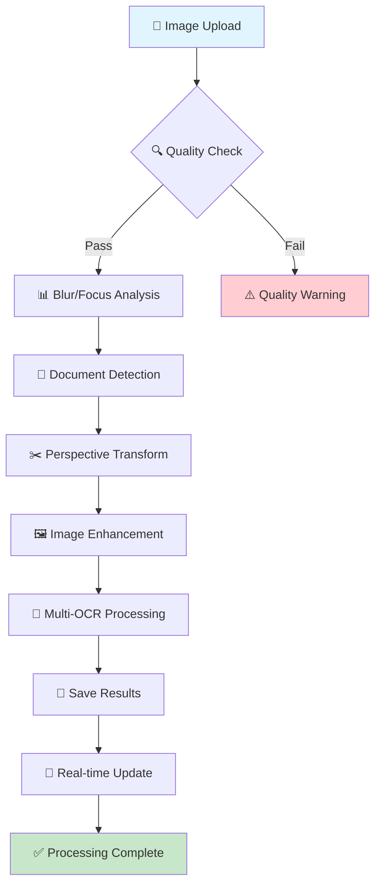

1113339987122<div align="center">

# 🪷 PrintChakra

### *AI-Powered Smart Print & Capture Solution*

[](https://github.com/chaman2003/printchakra)
[](https://www.python.org/)
[](https://reactjs.org/)
[](https://flask.palletsprojects.com/)
[](https://www.typescriptlang.org/)
[](https://opensource.org/licenses/MIT)

**Transform your documents with intelligent OCR processing and real-time automation**

[Features](#-key-features) • [Quick Start](#-quick-start) • [Architecture](#️-architecture) • [Documentation](#-documentation) • [API](#-api-reference)

---

</div>

## 💡 What is PrintChakra?

PrintChakra is a **complete automated document scanning system** that combines advanced OCR technology with seamless web and mobile interfaces. Print a blank page, and watch your phone automatically capture and process documents with AI-powered enhancement and intelligent text extraction.

Perfect for digitizing physical documents, extracting text from images, and building automated document workflows with real-time synchronization between desktop and mobile devices.

---

## ✨ Key Features
<table>
<tr>
<td width="50%">

### 🖥️ **Desktop Dashboard**
- 📊 Manage processed documents
- 📄 View extracted OCR text
- 📥 Download enhanced images
- ⚡ Real-time auto-refresh
- 🎛️ Advanced processing options
- 🔧 Pipeline configuration display
- 📦 Batch file operations
- 🔄 Socket.IO synchronization

<td width="50%">

### 📱 **Mobile Capture**
- 📷 Auto-trigger from desktop
- 🎯 Manual photo upload
- 🔄 Instant processing feedback
- 🌐 Socket.IO synchronization
- ✨ Seamless user experience
- ✅ **Real-time quality validation**
- 📊 Blur & focus score metrics
- 🎯 Document border detection

</td>
</tr>
<tr>
<td width="50%">

### 🤖 **AI Processing Pipeline**
- 🔍 Multi-strategy document detection
- ✂️ Perspective correction & cropping
- � 12-stage sequential processing
- 📐 Corner refinement algorithms
- 🖼️ 4-stage image enhancement
- 📝 Multi-configuration OCR (15 attempts)
- � Automatic best-result selection
- 📋 Document classification (optional)

</td>
<td width="50%">

### 🚀 **Developer Experience**
- ⚡ One-command startup scripts
- 🔧 PowerShell automation
- 🌍 ngrok public tunneling
- 📦 Pre-configured deployment
- 🛠️ Comprehensive logging
- 📚 Complete API documentation
- 🧪 Advanced testing tools
- 🔄 File conversion (PDF, DOCX)

</td>
</tr>
</table>

---

## 🏗️ Architecture

<div align="center">

### 🌟 **PrintChakra System Overview**

```
╔══════════════════════════════════════════════════════════════════════════════════════════════╗
║                                                                                              ║
║                    🪷 PrintChakra v2.1.0 - AI-Powered Document Processing                    ║
║                                                                                              ║
╠══════════════════════════════════════════════════════════════════════════════════════════════╣
║                                                                                              ║
║  ┌─────────────────────────────────┐    ┌─────────────────────────────────────────────────┐  ║
║  │         📱 MOBILE CLIENT        │    │             🖥️ DESKTOP BACKEND                │  ║
║  │                                 │    │                                                 │  ║
║  │  ┌─────────────────────────┐    │    │  ┌─────────────────────────────────────────────┐ │  ║
║  │  │    📷 Camera Capture    │◄───┼────┼─►│       🌐 Flask-SocketIO Server            │ │  ║
║  │  │    📤 Real-time Upload  │    │    │  │       🔄 WebSocket Communication          │ │  ║
║  │  └─────────────────────────┘    │    │  └─────────────────────────────────────────────┘ │  ║
║  │                                 │    │                                                 │  ║
║  │  ┌─────────────────────────┐    │    │  ┌─────────────────────────────────────────────┐ │  ║
║  │  │   🎯 Quality Validation │◄───┼────┼─►│       🤖 AI Processing Pipeline            │ │  ║
║  │  │   📊 Blur/Focus Scores  │    │    │  │       � 12-Stage Sequential Processing    │ │  ║
║  │  └─────────────────────────┘    │    │  └─────────────────────────────────────────────┘ │  ║
║  │                                 │    │                                                 │  ║
║  └─────────────────────────────────┘    └─────────────────────────────────────────────────┘  ║
║                                                                                              ║
╠══════════════════════════════════════════════════════════════════════════════════════════════╣
║                                                                                              ║
║                           🔄 DATA FLOW & STORAGE ARCHITECTURE                                ║
║                                                                                              ║
╠══════════════════════════════════════════════════════════════════════════════════════════════╣
║                                                                                              ║
║  📁 data/                                                                                     ║
║  ├── 📤 uploads/           # Original captured images                                        ║
║  ├── ⚙️ processed/         # Enhanced processed images                                       ║
║  ├── 📝 processed_text/    # Extracted OCR text files                                        ║
║  ├── 📄 pdfs/              # Generated PDF documents                                         ║
║  └── 🔄 converted/         # Format-converted files (DOCX, etc.)                             ║
║                                                                                              ║
╚══════════════════════════════════════════════════════════════════════════════════════════════╝
```

</div>

### 🔄 **Processing Pipeline Flow**

<div align="center">

```
┌─────────────┐    ┌─────────────────┐    ┌─────────────────┐    ┌─────────────────┐
│  📱 Upload  │───►│  🔍 Detection   │───►│  ✂️ Transform    │───►│  🖼️ Enhance     │
│   Image     │    │   Document      │    │   Perspective    │    │   Image         │
└─────────────┘    └─────────────────┘    └─────────────────┘    └─────────────────┘
                                                        │
                                                        ▼
┌─────────────┐    ┌─────────────────┐    ┌─────────────────┐    ┌─────────────────┐
│  📝 OCR     │───►│  💾 Save        │───►│  🔄 Socket.IO   │───►│  🎯 Complete    │
│   Extract   │    │   Results       │    │   Update        │    │   Processing    │
└─────────────┘    └─────────────────┘    └─────────────────┘    └─────────────────┘
```

</div>

### 📊 **12-Stage Processing Pipeline**

<div align="center">

| 🎯 **Stage** | ⚙️ **Process** | 🛠️ **Technology** | 📋 **Description** | 🔄 **Progress** |
|-------------|---------------|------------------|-------------------|----------------|
| **1** | 📥 **Load Image** | OpenCV | Load and validate input image | ████████░░ 80% |
| **2** | 🔍 **Document Detection** | Multi-Strategy | 8 scoring factors, multiple algorithms | ████████░░ 80% |
| **3** | ✂️ **Perspective Transform** | OpenCV | Four-point transform with corner refinement | ████████░░ 80% |
| **4** | 🖼️ **Grayscale Conversion** | OpenCV | Convert to grayscale for processing | ████████░░ 80% |
| **5** | 🌫️ **Gaussian Blur** | OpenCV | Reduce noise while preserving edges | ████████░░ 80% |
| **6** | 📏 **Edge Detection** | Canny | Multi-threshold edge detection | ████████░░ 80% |
| **7** | ⚪ **Binary Thresholding** | Otsu | Adaptive thresholding | ████████░░ 80% |
| **8** | 🔷 **Morphological Ops** | OpenCV | Clean and refine binary image | ████████░░ 80% |
| **9** | 📐 **Contour Detection** | OpenCV | Find document boundaries | ████████░░ 80% |
| **10** | 📏 **Image Resizing** | OpenCV | Optimize for OCR processing | ████████░░ 80% |
| **11** | ✨ **Brightness Enhancement** | CLAHE | Contrast Limited Adaptive Histogram Equalization | ████████░░ 80% |
| **12** | 📝 **OCR Extraction** | Tesseract | 15-config multi-attempt OCR | ████████░░ 80% |

</div>

### 🎨 **Visual Processing Flow**

<div align="center">



</div>

### 🏛️ **System Architecture Components**

<div align="center">

#### **Backend Architecture**
```
┌─────────────────────────────────────────────────────────────────────────────────┐
│                           🐍 Flask Backend Server                               │
├─────────────────────────────────────────────────────────────────────────────────┤
│                                                                                 │
│  ┌─────────────────┐  ┌─────────────────┐  ┌─────────────────┐  ┌─────────────┐ │
│  │   🌐 REST API   │  │  🔌 Socket.IO   │  │   📁 File I/O   │  │  ⚙️ Config   │ │
│  │   18 Endpoints  │  │ Real-time Comm  │  │   Storage       │  │   Settings  │ │
│  └─────────────────┘  └─────────────────┘  └─────────────────┘  └─────────────┘ │
│                                                                                 │
│  ┌─────────────────────────────────────────────────────────────────────────────┐ │
│  │                    🤖 AI Processing Modules (12)                           │ │
│  ├─────────────────────────────────────────────────────────────────────────────┤ │
│  │ • pipeline.py          • document_detection.py  • image_enhancement.py     │ │
│  │ • ocr_ai.py           • utility.py            • api_endpoints.py          │ │
│  │ • export.py           • file_converter.py     • scanning.py                │ │
│  │ • storage.py          • enhanced_pipeline.py  • enhanced_pipeline.py      │ │
│  └─────────────────────────────────────────────────────────────────────────────┘ │
│                                                                                 │
└─────────────────────────────────────────────────────────────────────────────────┘
```

#### **Frontend Architecture**
```
┌─────────────────────────────────────────────────────────────────────────────────┐
│                         ⚛️ React Frontend Application                           │
├─────────────────────────────────────────────────────────────────────────────────┤
│                                                                                 │
│  ┌─────────────────┐  ┌─────────────────┐  ┌─────────────────┐  ┌─────────────┐ │
│  │   📱 Dashboard   │  │   📷 Phone UI   │  │   🔌 Socket.IO  │  │   🎨 Chakra │ │
│  │   File Mgmt     │  │   Camera        │  │   Client        │  │   UI Theme  │ │
│  └─────────────────┘  └─────────────────┘  └─────────────────┘  └─────────────┘ │
│                                                                                 │
│  ┌─────────────────────────────────────────────────────────────────────────────┐ │
│  │                      � Mobile-First Responsive Design                      │ │
│  ├─────────────────────────────────────────────────────────────────────────────┤ │
│  │ • Real-time processing updates  • Quality validation feedback              │ │
│  │ • Batch file operations         • Document border detection                 │ │
│  │ • Progressive Web App ready     • Offline-capable interface                │ │
│  └─────────────────────────────────────────────────────────────────────────────┘ │
│                                                                                 │
└─────────────────────────────────────────────────────────────────────────────────┘
```

#### **Infrastructure & Deployment**
```
┌─────────────────────────────────────────────────────────────────────────────────┐
│                        🚀 Deployment & Infrastructure                           │
├─────────────────────────────────────────────────────────────────────────────────┤
│                                                                                 │
│  ┌─────────────────┐  ┌─────────────────┐  ┌─────────────────┐  ┌─────────────┐ │
│  │   🌐 ngrok      │  │   ☁️ Vercel     │  │   � Docker     │  │   🔧 Scripts │ │
│  │   Tunneling     │  │   Frontend      │  │   Container    │  │   Automation │ │
│  └─────────────────┘  └─────────────────┘  └─────────────────┘  └─────────────┘ │
│                                                                                 │
│  ┌─────────────────────────────────────────────────────────────────────────────┐ │
│  │                    🔄 CI/CD & Automation Pipeline                           │ │
│  ├─────────────────────────────────────────────────────────────────────────────┤ │
│  │ • PowerShell setup scripts    • Automated testing                          │ │
│  │ • Environment configuration   • One-command deployment                     │ │
│  │ • Health monitoring           • Backup & recovery                           │ │
│  └─────────────────────────────────────────────────────────────────────────────┘ │
│                                                                                 │
└─────────────────────────────────────────────────────────────────────────────────┘
```

</div>

### 🔗 **Data Flow Architecture**

<div align="center">

```
🌐 User Interaction
        │
        ▼
� Frontend (React + Socket.IO)
        │
        ├─📤 HTTP Requests ──┐
        └─🔌 WebSocket ──────┼─► 🖥️ Backend (Flask + SocketIO)
                              │
                              ├─⚙️ Processing Pipeline ──┐
                              ├─💾 File Storage ────────┼─► 📁 Data Directory
                              └─📊 Real-time Updates ──┘
```

</div>

### 🎯 **Key Architectural Benefits**

<div align="center">

| ✨ **Aspect** | 🏗️ **Implementation** | 🎯 **Benefit** |
|---------------|----------------------|---------------|
| **🏗️ Modularity** | 12 specialized modules | 🔧 Easy maintenance & testing |
| **⚡ Performance** | Async processing + WebSocket | 📈 Real-time user feedback |
| **🔧 Scalability** | Microservices architecture | 📊 Horizontal scaling ready |
| **🛡️ Reliability** | Error handling + fallbacks | ✅ Robust operation |
| **📱 Mobile-First** | Responsive design | 🌐 Cross-device compatibility |
| **🔄 Automation** | PowerShell scripts | 🚀 One-command deployment |
| **🔒 Security** | CORS + input validation | 🛡️ Secure data handling |
| **📊 Monitoring** | Comprehensive logging | 📈 Full observability |

</div>

### 🌟 **System Interaction Flow**

<div align="center">

```
╔══════════════════════════════════════════════════════════════════════════════════════════════╗
║                                                                                              ║
║                               📱 PrintChakra User Journey                                   ║
║                                                                                              ║
╠══════════════════════════════════════════════════════════════════════════════════════════════╣
║                                                                                              ║
║  1️⃣ User clicks "Print Blank" ──────────────────────────────────────────────────────────────► ║
║     │                                                                                        ║
║     └─► 🖨️ Windows Print API ──► 📄 PDF Generation ──► 🖨️ Physical Print                  ║
║                                                                                              ║
║  2️⃣ Phone camera activates ────────────────────────────────────────────────────────────────► ║
║     │                                                                                        ║
║     └─► 📷 Camera Capture ──► 📤 Image Upload ──► 🔄 Socket.IO Notification                ║
║                                                                                              ║
║  3️⃣ Real-time processing ─────────────────────────────────────────────────────────────────► ║
║     │                                                                                        ║
║     └─► ⚙️ AI Pipeline ──► 📊 Progress Updates ──► 💾 Results Storage ──► ✅ Complete     ║
║                                                                                              ║
║  4️⃣ User receives results ────────────────────────────────────────────────────────────────► ║
║     │                                                                                        ║
║     └─► 📄 Enhanced Image ──► 📝 OCR Text ──► 📥 Download Options ──► 🎉 Success          ║
║                                                                                              ║
╚══════════════════════════════════════════════════════════════════════════════════════════════╝
```

</div>

### 🏆 **Architecture Highlights**

<div align="center">

#### **🎨 Design Philosophy**
- **Mobile-First**: Optimized for phone camera input
- **Real-Time**: WebSocket-powered live updates
- **Modular**: 12 specialized processing modules
- **Scalable**: Microservices-ready architecture
- **Automated**: One-command setup and deployment

#### **⚡ Performance Features**
- **Async Processing**: Non-blocking background tasks
- **Progress Tracking**: Real-time pipeline status
- **Quality Validation**: Pre-processing image checks
- **Batch Operations**: Multi-file processing support
- **Caching**: Intelligent result caching

#### **🔧 Developer Experience**
- **Hot Reload**: Frontend development server
- **Type Safety**: Full TypeScript coverage
- **API Documentation**: Comprehensive endpoint reference
- **Testing Suite**: Automated unit and integration tests
- **CI/CD Ready**: Deployment automation scripts

</div>

---

## 🚀 Quick Start

### 📋 Prerequisites

| Requirement | Version | Download Link |
|-------------|---------|---------------|
| 🐍 Python | 3.8+ | [python.org](https://www.python.org/downloads/) |
| 📦 Node.js | 16+ | [nodejs.org](https://nodejs.org/) |
| 🔍 Tesseract OCR | Latest | [UB-Mannheim](https://github.com/UB-Mannheim/tesseract/wiki) |
| 🔧 Git | Latest | [git-scm.com](https://git-scm.com/) |

### ⚡ Installation

```bash
# 1. Clone the repository
git clone https://github.com/chaman2003/printchakra.git
cd printchakra

# 2. Setup backend (automated - creates venv + installs dependencies)
.\scripts\setup-backend.ps1

# 3. Setup frontend
cd frontend
npm install
```

> 💡 **New!** The `setup-backend.ps1` script automatically creates a virtual environment and installs all Python dependencies. No manual setup needed!

### 🎯 Launch Application

**Option A: Start Everything (Recommended)**
```powershell
# From project root
.\scripts\start-full-online.ps1    # With ngrok tunneling
# OR
.\scripts\start-full-offline.ps1   # Local only
```

**Option B: Start Components Separately**
```powershell
# Backend only
.\scripts\backend.ps1

# Frontend only (in new terminal)
cd frontend
npm start
```

**Access URLs:**
- 🔌 **Backend API**: http://localhost:5000
- 🖥️ **Frontend Dashboard**: http://localhost:3000
- 📱 **Mobile Capture**: http://localhost:3000/phone
- 🌐 **Public URL**: Check ngrok console for tunnel URL

### 🧪 Testing

```bash
# Run backend tests
cd backend
.\venv\Scripts\Activate.ps1
python -m pytest tests/ -v

# Run frontend tests
cd frontend
npm test
```

---

## 📁 Project Structure

```
printchakra/
│
├── 🔧 PowerShell Scripts (scripts/)
│   ├── setup-backend.ps1        # Automated backend setup + venv
│   ├── backend.ps1              # Start Flask backend only
│   ├── ngrok.ps1                # Start ngrok tunneling
│   ├── start-full-online.ps1    # Start all services + ngrok
│   ├── start-full-offline.ps1   # Start all services locally
│   ├── cleanup-data.ps1         # Clean data directories
│   ├── backup-data.ps1          # Backup processed files
│   └── restart-all.ps1          # Restart all services
│
├── 🐍 Backend (Flask + Python)
│   ├── app.py                   # Main Flask application (2074 lines)
│   ├── run.py                   # Alternative entry point
│   ├── requirements.txt         # Python dependencies (25+ packages)
│   ├── config/
│   │   ├── settings.py          # Centralized configuration
│   │   ├── __init__.py
│   │   └── __pycache__/
│   ├── modules/                 # Core processing modules
│   │   ├── pipeline.py          # Main processing pipeline
│   │   ├── document_detection.py # Multi-strategy detection
│   │   ├── image_enhancement.py # 4-stage enhancement
│   │   ├── ocr_ai.py           # Multi-config OCR (15 attempts)
│   │   ├── utility.py           # Helper functions
│   │   ├── api_endpoints.py     # API endpoint handlers
│   │   ├── export.py            # PDF/Export functionality
│   │   ├── file_converter.py    # File format conversion
│   │   ├── scanning.py          # Scanning utilities
│   │   ├── storage.py           # File storage management
│   │   ├── enhanced_pipeline.py # Advanced pipeline
│   │   └── __init__.py
│   ├── data/                   # Consolidated data directory
│   │   ├── uploads/            # Original uploaded files
│   │   ├── processed/          # Enhanced images
│   │   ├── processed_text/     # Extracted OCR text
│   │   ├── pdfs/               # Generated PDFs
│   │   └── converted/          # Converted files
│   ├── print_scripts/          # Windows printing
│   │   ├── create_blank_pdf.py # PDF generation
│   │   └── print-file.py       # Print automation
│   ├── logs/                   # Application logs
│   ├── tests/                  # Unit tests
│   │   ├── test_api.py
│   │   ├── test_conversion.py
│   │   └── test_sequential_processing.py
│   ├── static/                 # Static assets
│   └── __pycache__/
│
├── ⚛️ Frontend (React + TypeScript)
│   ├── package.json             # Node dependencies
│   ├── tsconfig.json            # TypeScript config
│   ├── vercel.json              # Vercel deployment
│   ├── public/
│   │   ├── index.html
│   │   ├── manifest.json
│   │   └── robots.txt
│   ├── src/
│   │   ├── App.tsx              # Main app component
│   │   ├── index.tsx            # React entry point
│   │   ├── config.ts            # API configuration (18 endpoints)
│   │   ├── theme.ts             # Chakra UI theme
│   │   ├── components/
│   │   │   └── Iconify.tsx      # Icon component
│   │   └── pages/
│   │       ├── Dashboard.tsx    # Document management (1076 lines)
│   │       ├── Phone.tsx        # Mobile capture interface
│   │       ├── Dashboard.css
│   │       └── Phone.css
│   ├── build/                   # Production build
│   └── node_modules/
│
├── 📚 Documentation & Notebooks
│   ├── README.md                # This file
│   ├── printchakra_clean.ipynb  # Original processing notebook
│   └── processing.ipynb         # Additional processing examples
│
├── 🔧 Configuration Files
│   ├── .gitignore               # Git ignore rules
│   ├── .env.example             # Environment variables
│   └── .env.local               # Local environment
│
└── 📦 Additional Files
    ├── input.jpg                # Test input image
    ├── output.jpg               # Test output image
    └── restart-all.ps1          # Service restart script
```

---

## 🛠️ Technology Stack

### Backend Technologies

| Technology | Version | Purpose |
|------------|---------|---------|
|  | 3.0.0 | Web framework & API |
|  | 5.3.5 | Real-time WebSocket |
|  | 4.10.0 | Computer vision & image processing |
|  | Latest | Text extraction & OCR |
|  | 2.1.1 | Numerical computing |
|  | 11.0+ | Image manipulation |
|  | 1.3+ | Machine learning (classification) |
|  | 307 | Windows printing API |
|  | 2.7.9 | PDF generation |
|  | 1.23+ | PDF manipulation |

### Frontend Technologies

| Technology | Version | Purpose |
|------------|---------|---------|
|  | 19.2.0 | UI framework |
|  | 4.9.5 | Type safety |
|  | 2.10.3 | Component library |
|  | 4.8.1 | WebSocket client |
|  | 1.12.2 | HTTP requests |
|  | 7.9.4 | Navigation |
|  | 11.11.17 | Animations |

### Infrastructure & Tools

- **ngrok** - Public tunneling service
- **Vercel** - Frontend deployment platform
- **PowerShell** - Windows automation scripts
- **Git** - Version control
- **Jupyter** - Development notebooks

---

## 📡 API Reference

### Core REST Endpoints

| Method | Endpoint | Description | Response |
|--------|----------|-------------|----------|
| `GET` | `/` | Server info & health check | Service metadata |
| `GET` | `/health` | Detailed health check | System status & features |
| `POST` | `/upload` | Upload & process image | Processing result |
| `GET` | `/files` | List processed files | File list with metadata |
| `GET` | `/processed/<file>` | Get enhanced image | Image file |
| `GET` | `/uploads/<file>` | Get original image | Image file |
| `DELETE` | `/delete/<file>` | Delete file & text | Success confirmation |
| `GET` | `/ocr/<file>` | Get extracted text | OCR text content |
| `POST` | `/print` | Trigger phone capture | Print command result |
| `GET` | `/processing-status/<file>` | Get processing status | Real-time progress |

### Advanced Processing Endpoints

| Method | Endpoint | Description | Features |
|--------|----------|-------------|----------|
| `POST` | `/process/advanced` | Advanced processing pipeline | Custom options, AI enhancement |
| `POST` | `/validate/quality` | Image quality validation | Blur/focus scoring |
| `POST` | `/detect/document` | Document border detection | Real-time corner detection |
| `POST` | `/export/pdf` | Export to PDF | Batch PDF generation |
| `GET` | `/pdf/<filename>` | Download PDF | Generated PDF files |
| `GET` | `/pipeline/info` | Pipeline configuration | Module status & features |
| `POST` | `/classify/document` | Document classification | ML-based categorization |
| `POST` | `/batch/process` | Batch file processing | Sequential processing |

### File Conversion Endpoints

| Method | Endpoint | Description | Formats |
|--------|----------|-------------|----------|
| `POST` | `/convert` | Convert file formats | JPG, PNG, PDF, DOCX |
| `GET` | `/converted/<file>` | Download converted file | Converted files |
| `GET` | `/get-converted-files` | List converted files | File metadata |

### Socket.IO Events

| Event | Direction | Payload | Description |
|-------|-----------|---------|-------------|
| `connect` | Client → Server | - | Client connection established |
| `disconnect` | Client → Server | - | Client disconnected |
| `upload_complete` | Server → Client | `{filename, success}` | File upload completed |
| `processing_complete` | Server → Client | `{filename, text, ...}` | OCR processing done |
| `processing_progress` | Server → Client | `{step, total, stage}` | Real-time progress updates |
| `file_deleted` | Server → Client | `{filename}` | File deletion notification |
| `capture_now` | Server → Client | `{message, timestamp}` | Trigger phone camera |
| `detection_result` | Server → Client | `{corners, success}` | Document detection result |
| `conversion_complete` | Server → Client | `{success_count, fail_count}` | File conversion completed |

---

## � Troubleshooting

### Backend Issues

<details>
<summary><b>Backend won't start</b></summary>

**Solutions:**
- Run setup script first: `.\scripts\setup-backend.ps1`
- Check Python version: `python --version` (need 3.8+)
- Check if venv exists: `Test-Path .\backend\venv`
- Manually activate venv: `.\backend\venv\Scripts\Activate.ps1`
- Reinstall dependencies: `pip install -r requirements.txt`
- Check port 5000: `netstat -ano | findstr :5000`
- Install Tesseract OCR and add to PATH

</details>

<details>
<summary><b>Socket.IO connection errors</b></summary>

**Solutions:**
- Check `frontend/src/config.ts` - ensure correct API_BASE_URL
- Verify Socket.IO versions match (backend 5.3.5, frontend 4.8.1)
- Check CORS settings in `backend/config/settings.py`
- Restart both backend and frontend servers
- Check browser console for WebSocket errors
- Use polling fallback: `transports: ['polling']`

</details>

<details>
<summary><b>OCR not working / Tesseract errors</b></summary>

**Solutions:**
- Install Tesseract: https://github.com/UB-Mannheim/tesseract/wiki
- Add to PATH: `C:\Program Files\Tesseract-OCR`
- Update path in `backend/app.py` if needed
- Test with: `tesseract --version`
- Check language data: `tesseract --list-langs`

</details>

### Frontend Issues

<details>
<summary><b>Frontend won't start</b></summary>

**Solutions:**
- Check Node.js version: `node --version` (need 16+)
- Install dependencies: `npm install` in frontend folder
- Check port 3000: `netstat -ano | findstr :3000`
- Clear cache: `npm cache clean --force`
- Check TypeScript errors: `npm run build`

</details>

<details>
<summary><b>Images not loading</b></summary>

**Solutions:**
- Check ngrok bypass header in `frontend/src/config.ts`
- Verify API_BASE_URL configuration
- Check browser network tab for CORS errors
- Use blob URLs for image loading (implemented)
- Check backend CORS settings

</details>

### Processing Issues

<details>
<summary><b>Document detection failing</b></summary>

**Solutions:**
- Ensure good lighting and contrast
- Hold camera steady for focus
- Check image quality scores in logs
- Adjust detection parameters in `backend/config/settings.py`
- Use manual upload if auto-detection fails

</details>

<details>
<summary><b>OCR quality poor</b></summary>

**Solutions:**
- Ensure clear, well-lit images
- Check image enhancement settings
- Try different PSM modes (3, 6, 4)
- Verify Tesseract language data
- Use preprocessing options

</details>

---

## 📚 Documentation

| Document | Description |
|----------|-------------|
| **[README.md](README.md)** | Complete setup & usage guide |
| **[printchakra_clean.ipynb](printchakra_clean.ipynb)** | Original processing algorithm notebook |
| **[processing.ipynb](processing.ipynb)** | Additional processing examples |
| **[backend/README.md](backend/README.md)** | Backend-specific documentation |
| **[frontend/README.md](frontend/README.md)** | Frontend development guide |

---

## 🗺️ Roadmap

### ✅ Completed Features (v2.1.0)

- [x] **Core Processing Pipeline**
  - Multi-strategy document detection (8 scoring factors)
  - 12-stage sequential processing with progress tracking
  - 4-stage image enhancement (brightness, contrast, CLAHE, denoising)
  - Multi-configuration OCR (15 attempts with best selection)

- [x] **Backend Architecture**
  - Flask 3.0 with Socket.IO 5.3.5 real-time communication
  - Modular architecture with 12 core modules
  - Centralized configuration system
  - Comprehensive error handling and logging

- [x] **Frontend Interface**
  - React 19 with TypeScript and Chakra UI
  - Real-time Socket.IO synchronization
  - Mobile-responsive design with camera integration
  - Advanced file management with batch operations

- [x] **Advanced Features**
  - Quality validation with blur/focus scoring
  - Document border detection with corner refinement
  - File conversion (PDF, DOCX, multiple formats)
  - Batch processing with sequential execution
  - PDF export and generation
  - Windows printing automation

- [x] **Developer Experience**
  - PowerShell automation scripts (8 scripts)
  - One-command setup and deployment
  - Comprehensive testing suite
  - ngrok public tunneling integration
  - Environment-based configuration

### 🎯 Future Enhancements

- [ ] **AI/ML Improvements**
  - Custom document classification models
  - Advanced OCR with transformer models
  - Auto-cropping optimization
  - Quality enhancement AI

- [ ] **Cloud Integration**
  - AWS S3 storage integration
  - Google Cloud Vision API
  - Multi-region deployment
  - Backup and sync features

- [ ] **Advanced Processing**
  - Multi-page document handling
  - Form recognition and extraction
  - Signature detection and verification
  - Table and structure recognition

- [ ] **User Experience**
  - Progressive Web App (PWA)
  - Offline processing capabilities
  - Advanced batch operations UI
  - Custom processing profiles

- [ ] **Enterprise Features**
  - User authentication and authorization
  - Team collaboration features
  - Audit logging and compliance
  - API rate limiting and quotas

---

## 🤝 Contributing

We welcome contributions! Please:

1. Fork the repository
2. Create feature branch: `git checkout -b feature/amazing-feature`
3. Commit changes: `git commit -m 'Add amazing feature'`
4. Push to branch: `git push origin feature/amazing-feature`
5. Open a Pull Request

**Development Setup:**
```bash
# Backend development
cd backend
.\venv\Scripts\Activate.ps1
pip install -r requirements.txt
python app.py

# Frontend development
cd frontend
npm install
npm start
```

---

## 📄 License

This project is licensed under the **MIT License** - see the [LICENSE](LICENSE) file for details.

---

## 👨‍💻 Author

**Chaman S**

- 🐙 GitHub: [@chaman2003](https://github.com/chaman2003)
- 📧 Email: [chamans7952@gmail.com](mailto:chamans7952@gmail.com)
- 📱 LinkedIn: [chaman2003](https://www.linkedin.com/in/chaman2003/)

---

## 🙏 Acknowledgments

Special thanks to:

- **[Tesseract OCR](https://github.com/tesseract-ocr/tesseract)** - Google's OCR engine
- **[OpenCV](https://opencv.org/)** - Computer vision library
- **[Flask](https://flask.palletsprojects.com/)** - Python web framework
- **[React](https://reactjs.org/)** - JavaScript UI library
- **[Socket.IO](https://socket.io/)** - Real-time communication
- **[Chakra UI](https://chakra-ui.com/)** - React component library
- **[ngrok](https://ngrok.com/)** - Public tunneling service
- **[NumPy](https://numpy.org/)** - Scientific computing
- **[scikit-learn](https://scikit-learn.org/)** - Machine learning

---

## 📊 System Requirements

### Minimum Requirements
- **OS**: Windows 10/11, macOS 10.15+, Linux (Ubuntu 18.04+)
- **RAM**: 4GB
- **Storage**: 2GB free space
- **Network**: Stable internet for ngrok tunneling

### Recommended Requirements
- **OS**: Windows 11, macOS 12+, Linux (Ubuntu 20.04+)
- **RAM**: 8GB
- **Storage**: 5GB free space
- **CPU**: Multi-core processor
- **Network**: High-speed internet

---

<div align="center">

### 💫 Made with ❤️ for intelligent document processing

**PrintChakra v2.1.0** • October 2025

[⬆ Back to Top](#-printchakra)

</div>

2. **Click "Print Blank"** → Triggers phone capture
3. **Upload/Capture Image** → Automatic processing
