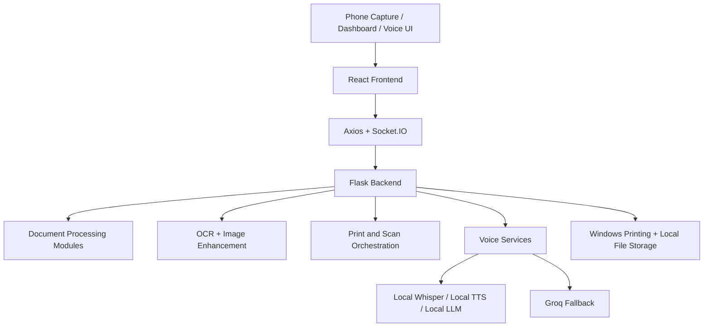

<div align="center">


<br />
<br />


<br />


</div>

---

## Overview

PrintChakra is a Windows-first document workflow platform built for scanning, OCR, print configuration, phone-assisted capture, and voice-driven interaction. It combines a Flask backend and a React frontend into a single experience for processing documents from intake to output.

It is designed around practical operations:

- Upload and manage document images and PDFs
- Clean and enhance scans before OCR or printing
- Extract text with OCR pipelines
- Configure print and scan workflows from the browser
- Capture documents from a phone-oriented flow
- Use voice sessions for transcription, orchestration, and spoken responses
- Keep UI state synchronized in real time through Socket.IO

---

## Quick Links

- [Stack](#stack)
- [Repository Layout](#repository-layout)
- [Setup](#setup)
- [Docker](#docker)
- [Run Locally](#run-locally)
- [Environment](#environment-configuration)
- [Features](#feature-highlights)
- [Architecture](#architecture)
- [Troubleshooting](#troubleshooting)

---

## Stack

<table>
<tr>
<td valign="top" width="50%">

### Backend

- Python
- Flask
- Flask-SocketIO
- OpenCV
- PaddleOCR
- Tesseract
- PyMuPDF and PDF tooling
- pywin32 for Windows printer integration
- Local Whisper, TTS, and LLM support
- Groq fallback for chat, STT, and TTS

</td>
<td valign="top" width="50%">

### Frontend

- React 19
- TypeScript
- Chakra UI
- Framer Motion
- Axios
- Socket.IO client
- React Router
- Responsive dashboard and landing page

</td>
</tr>
</table>

---

## Feature Highlights

<table>
<tr>
<td width="33%" valign="top">

### OCR Pipeline

Advanced document cleanup and OCR flow for scanned or photographed pages.

- Image enhancement
- Text extraction
- PDF and image handling
- Notebook-driven pipeline experimentation

</td>
<td width="33%" valign="top">

### Print Workflow

Browser-based print setup and orchestration for Windows environments.

- Print configuration UI
- Queue and device awareness
- Real-time status updates
- Workflow-driven execution

</td>
<td width="33%" valign="top">

### Voice Workflow

Voice session startup, transcription, chat, and speech response.

- Local-first voice stack
- Groq fallback support
- Frontend voice UI integration
- Orchestration-ready responses

</td>
</tr>
</table>

<table>
<tr>
<td width="33%" valign="top">

### Phone Capture

A phone-oriented intake flow for documents captured outside the desktop UI.

- Capture handoff
- Document intake path
- Processing-ready uploads

</td>
<td width="33%" valign="top">

### Real-Time Dashboard

Live file browsing, previews, system info, and document actions.

- Socket updates
- File previews
- Device panels
- Workflow access points

</td>
<td width="33%" valign="top">

### Windows Integration

Built around Windows printer and local device workflows.

- pywin32 printing
- Local file paths
- Windows-friendly setup
- Optional HTTPS locally

</td>
</tr>
</table>

---

## Repository Layout

```text
printchakra/
├── README.md
├── Document_Processing_Pipeline.ipynb
├── backend/
│   ├── app.py
│   ├── requirements.txt
│   ├── .venv/
│   ├── app/
│   │   ├── api/
│   │   ├── config/
│   │   ├── core/
│   │   ├── features/
│   │   ├── modules/
│   │   ├── sockets/
│   │   ├── utils/
│   │   ├── print_scripts/
│   │   └── .env
│   ├── public/
│   │   └── data/
│   └── logs/
├── frontend/
│   ├── package.json
│   ├── public/
│   └── src/
└── phase-2/
```

### Important Files

- Backend entry point: [backend/app.py](backend/app.py)
- Backend dependencies: [backend/requirements.txt](backend/requirements.txt)
- Frontend dependencies: [frontend/package.json](frontend/package.json)
- Backend environment file used by settings: [backend/app/.env](backend/app/.env)
- Notebook pipeline: [Document_Processing_Pipeline.ipynb](Document_Processing_Pipeline.ipynb)

---

## Setup

### Requirements

- Windows 10 or 11
- Python 3.10 recommended
- Node.js 18+
- npm

### Backend Setup

```powershell
cd backend
python -m venv .venv
.\.venv\Scripts\Activate.ps1
pip install -r requirements.txt
```

If [backend/.venv](backend/.venv) already exists and is working, reuse it.

### Frontend Setup

```powershell
cd frontend
npm install
```

---

## Docker

PrintChakra now includes a production-oriented Docker setup for the full app:

- Backend container on port 5000
- Frontend container on port 3000
- Persistent backend data mounted from [backend/public/data](backend/public/data)
- Linux-native OCR and PDF runtime packages baked into the backend image
- Optional host Ollama access through `host.docker.internal`

### Start With Compose

```powershell
docker compose up --build
```

### Container URLs

- Frontend: http://localhost:3000
- Backend: http://localhost:5000

### Important Docker Notes

- Browser-to-backend routing is controlled by `REACT_APP_API_URL` at frontend build time.
- The backend image sets `POPPLER_PATH=/usr/bin` and `TESSERACT_CMD=/usr/bin/tesseract`.
- Ollama is not bundled; by default Compose points the backend to `http://host.docker.internal:11434`.
- Windows-native printing is not available inside the default Linux container. Linux printing can work if the host exposes CUPS.

---

## Run Locally

### Backend

```powershell
cd backend
.\.venv\Scripts\Activate.ps1
python app.py
```

### Frontend

```powershell
cd frontend
npm run dev
```

### Pipecat Web Voice (3rd terminal)

Pipecat runs as a separate FastAPI WebSocket server used by the docked AI panel.

```powershell
cd pipecat-web-voice
python -m venv .venv
.\.venv\Scripts\Activate.ps1
pip install -r requirements.txt
python app.py
```

### Local URLs

- Frontend: usually http://localhost:5173 (Vite), sometimes http://localhost:3000 depending on your setup
- Backend: http://localhost:5000
- Pipecat WS: ws://localhost:8765/ws
- Pipecat health: http://localhost:8765/health
- Backend Pipecat proxy health: http://localhost:5000/pipecat/health

If port 3000 is occupied, the frontend may move to another port such as 3001.

---

## Voice + Pipecat Smoke Checklist

- **Backend**: `GET /pipecat/status` returns `available: true`
- **Backend**: `GET /pipecat/health` returns a non-empty `websocket_url`
- **Pipecat**: `GET http://localhost:8765/health` returns healthy
- **Dashboard**: docked AI panel connects and can play back TTS audio
- **Navigation**: backend Socket.IO `voice_command_detected` events can navigate routes while keeping the AI panel open

## Environment Configuration

The backend settings currently load environment variables from [backend/app/.env](backend/app/.env).

When running with Docker Compose, container environment variables override local file-based defaults.

### Example

```env
FRONTEND_URL=http://localhost:3000
BACKEND_PUBLIC_URL=http://localhost:5000
API_CORS_ORIGINS=http://localhost:3000

VOICE_AI_MODEL=smollm2:135m

GROQ_API_KEY=your_key_here
GROQ_LLM_MODEL=llama-3.1-8b-instant
GROQ_STT_MODEL=whisper-large-v3-turbo
GROQ_TTS_ENDPOINT=https://api.groq.com/openai/v1/audio/speech
GROQ_TTS_MODEL=canopylabs/orpheus-v1-english
```

### Optional HTTPS

The backend defaults to HTTP. HTTPS is opt-in.

```env
USE_HTTPS=1
SSL_CERT=certs/cert.pem
SSL_KEY=certs/key.pem
```

---

## Architecture


```mermaid
flowchart TD
    A[Phone Capture / Dashboard / Voice UI] --> B[React Frontend]
    B --> C[Axios + Socket.IO]
    C --> D[Flask Backend]
    D --> E[Document Processing Modules]
    D --> F[OCR + Image Enhancement]
    D --> G[Print and Scan Orchestration]
    D --> H[Voice Services]
    H --> I[Local Whisper / Local TTS / Local LLM]
    H --> J[Groq Fallback]
    D --> K[Windows Printing + Local File Storage]
```

---

## Voice Fallback Behavior

PrintChakra uses a local-first voice strategy and can fall back to Groq when local services are unavailable.

Configured fallback areas:

- LLM chat
- Speech-to-text
- Text-to-speech

The `/voice/status` endpoint reports current readiness for local and fallback providers.

---

## Data and Output Locations

Runtime file storage is served through backend data directories inside the backend tree.

Canonical backend test outputs are kept in:

- [backend/test/test_outputs](backend/test/test_outputs)

Redundant generated output folders outside that canonical path were intentionally cleaned up.

---

## Troubleshooting

### Backend does not start

Check:

- Python version is compatible
- The backend virtual environment is activated
- Port 5000 is not occupied by another process
- Dependencies from [backend/requirements.txt](backend/requirements.txt) are installed

### Frontend cannot reach backend

Check:

- Backend is running on port 5000
- Frontend dev server is running
- CORS points to the correct frontend origin
- Backend is not accidentally running under HTTPS while the frontend expects HTTP

### Voice features fail

Check:

- Local voice dependencies installed correctly
- Groq settings are present in [backend/app/.env](backend/app/.env) if fallback is expected
- `/voice/status` reports the providers you expect

### OCR is unavailable or slow

Check:

- PaddleOCR and image dependencies are installed
- PDF tooling is available for conversion paths
- `TESSERACT_CMD` points to a valid binary when running in a container
- GPU support is optional and CPU fallback may be slower

### Docker printing does not work

Check:

- The default containers are Linux-based and cannot use Windows `pywin32` printing
- Linux printing requires host CUPS access and compatible printer visibility
- For Windows printer integration, run the backend locally on Windows instead of inside Docker

---

## Notebook

The repository includes a standalone notebook for experimenting with the document pipeline:

- [Document_Processing_Pipeline.ipynb](Document_Processing_Pipeline.ipynb)

---

## Summary

PrintChakra is a document workflow app centered on OCR, print and scan control, voice interaction, and phone-assisted capture. For local development, use Python 3.10, run the backend on port 5000, run the frontend with `npm run dev`, and keep backend environment values in [backend/app/.env](backend/app/.env).

<div align="center">


</div>
