<div align="center">

# 🪷 PrintChakra

### *AI-Powered Smart Print & Scan Solution with Complete Hands-Free Orchestration*

[](https://github.com/chaman2003/printchakra)
[](https://www.python.org/)
[](https://reactjs.org/)
[](https://flask.palletsprojects.com/)
[](https://www.typescriptlang.org/)
[](https://opensource.org/licenses/MIT)

**Transform your documents with intelligent OCR processing, real-time automation, and complete hands-free voice control**

---

## 📑 Table of Contents

**Core Documentation**
- [Overview](#-overview)
- [Key Features](#-key-features)
- [Quick Start Guide](#-quick-start-guide)
- [Architecture](#️-architecture)
- [Technology Stack](#-technology-stack)
- [API Reference](#-api-reference)

**AI Orchestration System** 🤖
- [AI Orchestration Overview](#-ai-orchestration-system)
- [Voice-Assisted Workflow](#-voice-assisted-orchestration-new)
- [Quick Start (5 Minutes)](#-ai-orchestration-quick-start)
- [Voice Commands](#-voice-command-examples)
- [Orchestration Architecture](#-orchestration-architecture)

**Modularization & Structure**
- [Modular Architecture](#-modular-architecture)
- [Project Structure](#-project-structure)
- [Backend Architecture](#-backend-architecture-modular)
- [Frontend Architecture](#-frontend-architecture-modular)

**Configuration & Setup**
- [AI Models Setup](#-ai-models-setup)
- [Environment Configuration](#-environment-configuration)
- [Preview Size Adjustment](#-preview-size-adjustment)

**Additional Resources**
- [Troubleshooting](#-troubleshooting)
- [Roadmap](#-roadmap)
- [Contributing](#-contributing)
- [License & Author](#-license)

---

</div>

## 💡 Overview

PrintChakra is a **complete automated document processing system** with **AI-powered hands-free orchestration** that combines advanced OCR technology, voice control, and seamless web/mobile interfaces. Simply speak commands like "print this document" or "scan in high quality" and watch the AI intelligently handle the entire workflow.

### What Makes PrintChakra Unique?

- 🎤 **Voice-Controlled Operations** - Complete hands-free print and scan control
- 🤖 **AI Orchestration** - Intelligent workflow management with natural language understanding
- 📱 **Mobile-First Design** - Auto-triggered phone capture with real-time processing
- 🔍 **Advanced OCR Pipeline** - 12-stage sequential processing with multi-strategy document detection
- ⚡ **Real-Time Synchronization** - Socket.IO WebSocket communication for instant updates
- 🏗️ **Modular Architecture** - Clean, maintainable codebase with separation of concerns

Perfect for digitizing physical documents, extracting text from images, and building automated document workflows with complete voice control and real-time synchronization.

---

## ✨ Key Features
<table>
<tr>
<td width="50%">

### 🖥️ **Desktop Dashboard**
- 📊 Manage processed documents
- 📄 View extracted OCR text
- 📥 Download enhanced images
- ⚡ Real-time auto-refresh
- 🎛️ Advanced processing options
- 🔧 Pipeline configuration display
- 📦 Batch file operations
- 🔄 Socket.IO synchronization

<td width="50%">

### 📱 **Mobile Capture**
- 📷 Auto-trigger from desktop
- 🎯 Manual photo upload
- 🔄 Instant processing feedback
- 🌐 Socket.IO synchronization
- ✨ Seamless user experience
- ✅ **Real-time quality validation**
- 📊 Blur & focus score metrics
- 🎯 Document border detection

</td>
</tr>
<tr>
<td width="50%">

### 🤖 **AI Processing Pipeline**
- 🔍 Multi-strategy document detection
- ✂️ Perspective correction & cropping
- � 12-stage sequential processing
- 📐 Corner refinement algorithms
- 🖼️ 4-stage image enhancement
- 📝 Multi-configuration OCR (15 attempts)
- � Automatic best-result selection
- 📋 Document classification (optional)

</td>
<td width="50%">

### 🚀 **Developer Experience**
- ⚡ One-command startup scripts
- 🔧 PowerShell automation
- 🌍 ngrok public tunneling
- 📦 Pre-configured deployment
- 🛠️ Comprehensive logging
- 📚 Complete API documentation
- 🧪 Advanced testing tools
- 🔄 File conversion (PDF, DOCX)

</td>
</tr>
</table>

---

## 🤖 AI Orchestration System

PrintChakra features a **complete hands-free AI orchestration system** that enables autonomous print and scan operations through natural language and voice commands.

---

## 🎤 Voice-Assisted Orchestration **[NEW]**

**Intelligent voice-triggered workflow with automatic UI orchestration and natural language configuration.**

### ✨ Revolutionary Features

#### 🚀 **Automatic UI Triggering**
- Say "Let's print a document" or "Let's scan a document"
- Orchestration UI opens automatically - no manual clicks needed
- Skips mode selection and goes directly to configuration
- Voice mode indicator (🎤) shows you're in hands-free mode

#### 🧠 **Natural Language Configuration**
- **Print Settings**: "landscape", "3 copies", "color mode", "double sided", "A4 paper"
- **Scan Settings**: "600 DPI", "color scan", "PDF format", "grayscale"
- **Multiple Changes**: "Set to landscape and print 3 copies in color"
- **Smart Parsing**: Understands variations like "use color" or "switch to color mode"

#### 🔄 **Autonomous Workflow**
- No button clicks during voice mode
- Real-time configuration updates
- AI confirms each change: "Updated orientation, copies. Any other changes?"
- Say "That's all" or "No changes" when ready to proceed

---

## 🎙️ Complete Hands-Free Voice Control Guide

PrintChakra features a **complete hands-free AI voice assistant** for document operations. No keyboard or mouse needed!

### 🌟 Wake Word System

**IMPORTANT**: You MUST start every command with a wake word for the AI to listen.

#### ✅ Available Wake Words
Say any of these at the start of your command:
- **"Hey"** - Most common (Example: "Hey, print this document")
- **"Hi"** - Casual (Example: "Hi, scan in high quality")
- **"Hello"** - Polite (Example: "Hello, what can you do?")
- **"Okay"** - Confirmatory (Example: "Okay, show status")

#### ❌ Without Wake Word
```
You: "Print this document"
AI: ⚠️ Please say "Hey" first to talk with PrintChakra AI
```

#### ✅ With Wake Word
```
You: "Hey, print this document"
AI: ✅ Processing your command...
```

### 🎯 How to Use Hands-Free Mode

#### Step 1: Open Voice Chat
1. Click **"Talk with PrintChakra AI"** button (voice icon)
2. Click **"Start Voice Session"**
3. Wait for: "Voice AI Ready!"
4. Recording starts automatically

#### Step 2: Speak Commands
```
Recording indicator shows: "Recording - Say: Hey, Hi, Hello, or Okay"

You MUST say wake word first for EVERY command:
✅ "Hey, print this document"
✅ "Hi, what's happening?"
✅ "Hello, scan a document"
✅ "Okay, set to landscape"
```

#### Step 3: AI Responds
- AI transcribes your speech
- Displays what it heard: 🎤 Heard: "hey print this document"
- Processes command (wake word is stripped)
- Responds with text AND voice (TTS)
- Recording resumes automatically

#### Step 4: Continue Conversation
- AI listens continuously in 5-second cycles
- Say wake word for EACH command
- No need to click buttons
- Say "bye printchakra" to end session

### 📋 Complete Voice Command Reference

#### 🎤 Session Control
| Wake Word + Command | Result |
|---------------------|--------|
| "Hey, start" | Begin voice session |
| "Hi, help" | List available commands |
| "Hello, what can you do?" | Show capabilities |
| "Okay, show status" | Current system status |
| "Hey, bye printchakra" | End voice session |

#### 🖨️ Print Commands
| Wake Word + Command | Result |
|---------------------|--------|
| "Hey, print this document" | Start print workflow |
| "Hi, print in color" | Print with color mode |
| "Hello, print 3 copies" | Set copies to 3 |
| "Okay, landscape mode" | Change to landscape |
| "Hey, double sided printing" | Enable duplex |
| "Hi, A4 paper size" | Set paper to A4 |

#### 📸 Scan Commands
| Wake Word + Command | Result |
|---------------------|--------|
| "Hey, scan a document" | Start scan workflow |
| "Hi, scan in high quality" | High resolution scan |
| "Hello, 600 DPI scan" | Set resolution |
| "Okay, color scan" | Color scanning mode |
| "Hey, save as PDF" | PDF format output |
| "Hi, grayscale scan" | Grayscale mode |

#### ⚙️ Configuration Commands
| Wake Word + Command | Result |
|---------------------|--------|
| "Hey, set to landscape and 3 copies" | Multiple settings |
| "Hi, use color mode" | Change color setting |
| "Hello, switch to portrait" | Change orientation |
| "Okay, high quality print" | Quality adjustment |
| "Hey, that's all" | Finish configuration |

#### 🗣️ Conversation Commands
| Wake Word + Command | Result |
|---------------------|--------|
| "Hey, who are you?" | AI introduces itself |
| "Hi, how are you?" | Friendly conversation |
| "Hello, what time is it?" | Get current time |
| "Okay, list documents" | Show available files |
| "Hey, what's the weather?" | General queries |

### 🎬 Complete Hands-Free Workflow Examples

#### Example 1: Simple Print
```
🎤 You: "Hey, print this document"
   → UI opens with voice mode indicator 🎤
   
🤖 AI: "What options would you like to change or edit?"
   → Shows current settings
   
🎤 You: "Hi, that's all"
   
🤖 AI: "Perfect! Your settings are ready. Shall we proceed?"
   
🎤 You: "Hey, yes"
   
🤖 AI: "Print job sent successfully"
   → ✅ Complete - no keyboard/mouse used
```

#### Example 2: Custom Print Settings
```
🎤 You: "Hey, let's print a document"
   → Orchestration UI opens automatically
   
🤖 AI: "What options would you like to change?"
   
🎤 You: "Hi, set to landscape and print 3 copies in color"
   → Settings update in real-time
   
🤖 AI: "Updated orientation: landscape, copies: 3, color: enabled. 
        Any other changes?"
   
🎤 You: "Hello, make it double sided"
   → Duplex setting enabled
   
🤖 AI: "Updated duplex: enabled. Any other changes?"
   
🎤 You: "Okay, that's all"
   
🤖 AI: "Perfect! Ready to proceed. Shall we execute?"
   
🎤 You: "Hey, yes please"
   
🤖 AI: "Print job sent successfully with your settings"
   → ✅ Completely hands-free
```

#### Example 3: High Quality Scan
```
🎤 You: "Hey, scan a document"
   → Phone camera interface opens
   
🤖 AI: "Ready to scan. What settings would you like?"
   
🎤 You: "Hi, 600 DPI in color and save as PDF"
   → Settings configured
   
🤖 AI: "Set to 600 DPI, color mode, PDF format. Proceed?"
   
🎤 You: "Okay, yes"
   
🤖 AI: "Please capture the document with your phone"
   → 📱 Camera active
   
[You take photo]

🤖 AI: "Processing... Document scanned successfully at 600 DPI"
   → ✅ Scan complete
```

### 💡 Pro Tips for Hands-Free Operation

#### ✨ Wake Word Best Practices
- **Always start with wake word**: "Hey", "Hi", "Hello", or "Okay"
- **Speak clearly**: Good audio quality helps
- **Natural speech**: Don't rush or over-enunciate
- **One command at a time**: Wait for AI response between commands
- **Wake word every time**: Required for EVERY command, not just first

#### 🎯 Optimal Speaking Patterns
```
✅ Good Examples:
"Hey, print this document in color"
"Hi, scan at 600 DPI"
"Hello, set to landscape"
"Okay, that's all"

❌ Common Mistakes:
"Print this document" (missing wake word)
"the document" (incomplete command)
"uh hey print um" (too many filler words)
```

#### 🔊 Audio Quality Tips
- **Quiet environment**: Reduce background noise
- **Good microphone**: Use quality mic if available
- **Normal volume**: Don't whisper or shout
- **Clear diction**: Pronounce wake words clearly
- **5-second recording**: Commands captured in 5-second windows

#### ⚡ Workflow Efficiency
- **Chain commands**: "Hey, landscape and 3 copies and color mode"
- **Use shortcuts**: "Hi, that's all" instead of long phrases
- **Confirm quickly**: Just say "Okay, yes" or "Hey, proceed"
- **Natural conversation**: AI understands context

### 🎤 Voice AI Technical Details

#### Speech Recognition
- **Engine**: Whisper Large-v3 Turbo (local GGML model)
- **Language**: English (extensible to other languages)
- **Accuracy**: 95%+ with good audio quality
- **Processing**: Local/offline for privacy
- **Speed**: ~2-3 seconds per command

#### Text-to-Speech (TTS)
- **Voice**: Microsoft Ravi (Indian English)
- **Fallback**: David/Zira (SAPI5)
- **API**: Windows Runtime OneCore
- **Quality**: Natural, clear voice
- **Speed**: Real-time response

#### Conversation AI
- **Model**: Smollm2:135m (Ollama)
- **Memory**: Contextual conversation history
- **Response**: 5-12 words (concise and natural)
- **Style**: Friendly, helpful assistant

### 🔧 Customizing Wake Words

Want different wake words? Edit `backend/modules/voice_ai.py`:

```python
# Line 768
wake_words = ['hey', 'hi', 'hello', 'okay']  # Add your own!

# Examples:
wake_words = ['jarvis', 'computer', 'assistant']
wake_words = ['alexa', 'siri', 'cortana']  # Use familiar names
wake_words = ['print', 'scan', 'chakra']  # Task-specific
```

### 🆘 Troubleshooting Voice Commands

#### "Please say 'Hey' first" Message
**Cause**: No wake word detected at start of command  
**Solution**: Always start with "Hey", "Hi", "Hello", or "Okay"

#### "No speech detected"
**Cause**: Silent audio or poor microphone  
**Solution**: 
- Check microphone permissions
- Speak louder/clearer
- Test microphone in system settings

#### AI Not Responding
**Cause**: Session not active or TTS playing  
**Solution**:
- Click "Start Voice Session"
- Wait for TTS to finish speaking
- Check backend logs for errors

#### Incorrect Transcription
**Cause**: Poor audio quality or background noise  
**Solution**:
- Move to quieter environment
- Use better microphone
- Speak more clearly
- Avoid filler words (um, uh, like)

### 📊 Voice Command Success Rate

| Scenario | Success Rate | Notes |
|----------|--------------|-------|
| Simple commands with wake word | 95%+ | "Hey, print this" |
| Complex multi-setting commands | 90%+ | "Hi, landscape and 3 copies" |
| Conversation questions | 85%+ | "Hello, who are you?" |
| Commands without wake word | 0% | ❌ Will be rejected |
| Background noise environment | 70-80% | Depends on noise level |

### 🎯 Quick Example

```
You: "Let's print a document"
   → UI opens automatically in voice mode 🎤
   
AI: "What options would you like to change or edit?"
   → Voice tips displayed in UI
   
You: "Set to landscape and 3 copies"
   → Configuration updates instantly
   
AI: "Updated orientation: landscape, copies: 3. Any other changes?"
   → Changes reflected in real-time
   
You: "That's all"
   → Ready to confirm and execute
   
AI: "Perfect! Your settings are ready. Shall we proceed?"
```

### 📝 Quick Reference Card

<div align="center">

```
╔══════════════════════════════════════════════════════════════════════════════╗
║                     🎙️ HANDS-FREE VOICE COMMANDS                           ║
║                      PrintChakra AI Quick Reference                         ║
╠══════════════════════════════════════════════════════════════════════════════╣
║                                                                              ║
║  🔑 WAKE WORDS (Required at start of EVERY command)                         ║
║     "Hey" • "Hi" • "Hello" • "Okay"                                         ║
║                                                                              ║
║  📋 BASIC COMMANDS                                                           ║
║     Hey, print this document              → Start print workflow            ║
║     Hi, scan a document                   → Start scan workflow             ║
║     Hello, what can you do?               → Show help                       ║
║     Okay, show status                     → System status                   ║
║     Hey, bye printchakra                  → End session                     ║
║                                                                              ║
║  🖨️ PRINT SETTINGS                                                          ║
║     Hey, landscape mode                   → Change orientation              ║
║     Hi, 3 copies                          → Set copy count                  ║
║     Hello, color mode                     → Enable color                    ║
║     Okay, double sided                    → Enable duplex                   ║
║     Hey, A4 paper                         → Set paper size                  ║
║                                                                              ║
║  📸 SCAN SETTINGS                                                            ║
║     Hey, 600 DPI                          → Set resolution                  ║
║     Hi, color scan                        → Color mode                      ║
║     Hello, grayscale                      → Grayscale mode                  ║
║     Okay, save as PDF                     → Set format                      ║
║                                                                              ║
║  🔄 WORKFLOW CONTROL                                                         ║
║     Hey, that's all                       → Finish configuration            ║
║     Hi, proceed                           → Execute action                  ║
║     Hello, yes                            → Confirm                         ║
║     Okay, cancel                          → Cancel operation                ║
║                                                                              ║
║  💡 PRO TIPS                                                                 ║
║     • Wake word REQUIRED for every command                                  ║
║     • Speak clearly in quiet environment                                    ║
║     • Wait for AI response between commands                                 ║
║     • Use natural speech (don't rush)                                       ║
║     • 5-second recording windows                                            ║
║                                                                              ║
║  ❌ COMMON MISTAKES                                                          ║
║     "Print this" → Missing wake word                                        ║
║     "um hey like print" → Too many fillers                                  ║
║     Speaking while AI is talking → Wait for TTS to finish                   ║
║                                                                              ║
╚══════════════════════════════════════════════════════════════════════════════╝
```

**Print This Reference Card!**  
Keep it near your desk for quick command lookup while using hands-free mode.

</div>

### 📋 Voice Command Reference

#### Print Configuration Commands
| Say This | Result |
|----------|--------|
| "landscape" or "portrait" | Changes orientation |
| "3 copies" or "print 5 copies" | Sets number of copies |
| "color mode" or "use color" | Switches to color printing |
| "black and white" or "grayscale" | Switches to B&W |
| "double sided" or "duplex" | Enables duplex printing |
| "A4 paper" or "letter size" | Changes paper size |
| "high quality" or "draft mode" | Adjusts print quality |

#### Scan Configuration Commands
| Say This | Result |
|----------|--------|
| "600 DPI" or "scan at 1200 DPI" | Sets resolution |
| "color scan" | Color scanning mode |
| "grayscale" or "black and white" | Grayscale mode |
| "save as PDF" or "PNG format" | Sets output format |
| "A4 size" or "letter size" | Sets page size |

#### Control Commands
| Say This | Result |
|----------|--------|
| "that's all" or "no changes" | Finish configuration |
| "done" or "proceed" | Ready to execute |
| "continue" or "I'm good" | Complete settings |

### 🔧 Technical Implementation

**Backend Components:**
- `orchestration_service.py`: Voice-triggered intent handling with `parse_voice_configuration()`
- `app.py`: Enhanced `/voice/process` endpoint with configuration state detection
- New endpoint: `/orchestrate/voice-config` for voice-based configuration parsing

**Frontend Components:**
- `OrchestrationOverlay.tsx`: Voice mode detection and automatic UI opening
- Real-time Socket.IO synchronization
- Contextual voice tips display

**Voice Processing Flow:**
```
Voice Input → Whisper Transcription → Intent Detection → 
  ├─ New Intent (Print/Scan): Open UI with voice mode
  └─ In CONFIGURING State: Parse configuration changes
```

---

### 🎯 Key Capabilities

#### Natural Language Understanding
- Detects user intent from text or voice commands
- Automatically extracts parameters (copies, color mode, paper size, duplex, resolution)
- Understands contextual commands like "print this in color" or "scan in high quality"

#### Intelligent Workflow Management
- **State Machine**: Tracks workflow state (idle → awaiting confirmation → executing → completed)
- **Confirmation Flow**: Always asks "Shall we proceed?" before executing actions for safety
- **Auto-Selection**: Automatically selects document if only one is available
- **Configuration Memory**: Remembers and applies user preferences

#### Voice Integration
- Seamlessly integrates with Voice AI (Whisper + Smollm2)
- Hands-free operation via voice commands
- Real-time feedback via TTS (Text-to-Speech)
- Automatic intent detection from transcribed speech

#### Real-Time UI Synchronization
- Socket.IO events keep frontend in sync with backend state
- Live status updates with color-coded indicators
- Visual feedback for all operations
- Animated overlays and notifications

### 🎤 Voice Command Examples

```bash
# Print Operations
"Print this document"
"Print in color"
"Print 3 copies"
"Print double-sided on A4"
"Print both sides in grayscale"

# Scan Operations
"Scan a document"
"Scan in high quality"
"Scan as PDF"
"Capture a document"

# Status & Help
"What's happening?"
"Show status"
"List documents"
"What can you do?"
"Help"
```

### 🎬 Example Workflow

```
1. User says: "Print the latest document in color"
   ↓
2. AI transcribes: "print the latest document in color"
   ↓
3. Orchestration detects: PRINT intent + color_mode=color
   ↓
4. System responds: "Ready to print doc_20251031.jpg (1 copy, color, A4). Shall we proceed?"
   ↓
5. User says: "Yes"
   ↓
6. Orchestration executes print job
   ↓
7. System responds: "Print job sent successfully"
```

### 🏛️ Orchestration Architecture

```
┌─────────────────────────────────────────────────────────┐
│                    USER INTERFACE                        │
│                  (Voice AI + Overlay UI)                 │
└────────────────────┬────────────────────────────────────┘
                     │
                     ▼
┌─────────────────────────────────────────────────────────┐
│              ORCHESTRATION SERVICE                       │
│  • Intent Detection (Print, Scan, Status, etc.)         │
│  • Parameter Extraction (copies, color, duplex, etc.)   │
│  • State Machine (Idle → Awaiting → Executing)          │
│  • Workflow Management                                   │
└────────────────────┬────────────────────────────────────┘
                     │
                     ▼
┌─────────────────────────────────────────────────────────┐
│              ACTION EXECUTION                            │
│  • Print Service                                         │
│  • Scan Service                                          │
│  • Document Selection                                    │
│  • Configuration Management                              │
└─────────────────────────────────────────────────────────┘
```

### 📊 Orchestration State Machine

```
IDLE
  ↓ (user command)
AWAITING_CONFIRMATION
  ↓ (user confirms)
EXECUTING
  ↓ (completes)
COMPLETED
  ↓ (auto-reset)
IDLE
```

### 🔧 API Endpoints

```
POST /orchestrate/command      - Process natural language command
POST /orchestrate/confirm      - Confirm pending action
POST /orchestrate/cancel       - Cancel pending action
GET  /orchestrate/status       - Get current status
GET  /orchestrate/documents    - List available documents
POST /orchestrate/select       - Select specific document
POST /orchestrate/configure    - Update configuration
POST /orchestrate/reset        - Reset to idle state
GET  /orchestrate/history      - Get workflow history
```

### 🎯 Default Configuration

**Print Settings**:
- Copies: 1
- Paper Size: A4
- Color Mode: Color
- Duplex: Off
- Quality: High

**Scan Settings**:
- Resolution: 300 DPI
- Format: PDF
- Color Mode: Color
- Quality: High

---

## 🚀 AI Orchestration Quick Start

### Step 1: Start the System

```bash
# Terminal 1: Start Backend
cd backend
python app.py

# Terminal 2: Start Frontend
cd frontend
npm start
```

### Step 2: Test Voice Commands

1. Click **"Talk with PrintChakra AI"** button
2. Click **"Start Talking"**
3. Say: **"Print this document in color"**
4. System asks: "Shall we proceed?"
5. Say: **"Yes"**
6. ✅ Print job executes

### Step 3: Use Manual Orchestration

1. Click **"AI Orchestration"** button
2. View current system status
3. Type command: **"scan a document in high quality"**
4. Click **"Confirm & Execute"**
5. ✅ Phone interface opens for capture

### Pro Tips

- **Auto-Selection**: If only one document exists, it's selected automatically
- **Parameter Extraction**: System extracts settings from your commands automatically
- **Confirmation Safety**: System always asks before executing actions
- **Real-Time Updates**: UI updates instantly via WebSocket
- **Configuration Memory**: Default settings persist across sessions

---

## 🏗️ Architecture

<div align="center">

### 🌟 **PrintChakra System Overview**

```
╔══════════════════════════════════════════════════════════════════════════════════════════════╗
║                                                                                              ║
║                    🪷 PrintChakra v2.1.0 - AI-Powered Document Processing                    ║
║                                                                                              ║
╠══════════════════════════════════════════════════════════════════════════════════════════════╣
║                                                                                              ║
║  ┌─────────────────────────────────┐    ┌─────────────────────────────────────────────────┐  ║
║  │         📱 MOBILE CLIENT        │    │             🖥️ DESKTOP BACKEND                │  ║
║  │                                 │    │                                                 │  ║
║  │  ┌─────────────────────────┐    │    │  ┌─────────────────────────────────────────────┐ │  ║
║  │  │    📷 Camera Capture    │◄───┼────┼─►│       🌐 Flask-SocketIO Server            │ │  ║
║  │  │    📤 Real-time Upload  │    │    │  │       🔄 WebSocket Communication          │ │  ║
║  │  └─────────────────────────┘    │    │  └─────────────────────────────────────────────┘ │  ║
║  │                                 │    │                                                 │  ║
║  │  ┌─────────────────────────┐    │    │  ┌─────────────────────────────────────────────┐ │  ║
║  │  │   🎯 Quality Validation │◄───┼────┼─►│       🤖 AI Processing Pipeline            │ │  ║
║  │  │   📊 Blur/Focus Scores  │    │    │  │       � 12-Stage Sequential Processing    │ │  ║
║  │  └─────────────────────────┘    │    │  └─────────────────────────────────────────────┘ │  ║
║  │                                 │    │                                                 │  ║
║  └─────────────────────────────────┘    └─────────────────────────────────────────────────┘  ║
║                                                                                              ║
╠══════════════════════════════════════════════════════════════════════════════════════════════╣
║                                                                                              ║
║                           🔄 DATA FLOW & STORAGE ARCHITECTURE                                ║
║                                                                                              ║
╠══════════════════════════════════════════════════════════════════════════════════════════════╣
║                                                                                              ║
║  📁 data/                                                                                     ║
║  ├── 📤 uploads/           # Original captured images                                        ║
║  ├── ⚙️ processed/         # Enhanced processed images                                       ║
║  ├── 📝 processed_text/    # Extracted OCR text files                                        ║
║  ├── 📄 pdfs/              # Generated PDF documents                                         ║
║  └── 🔄 converted/         # Format-converted files (DOCX, etc.)                             ║
║                                                                                              ║
╚══════════════════════════════════════════════════════════════════════════════════════════════╝
```

</div>

### 🔄 **Processing Pipeline Flow**

<div align="center">

```
┌─────────────┐    ┌─────────────────┐    ┌─────────────────┐    ┌─────────────────┐
│  📱 Upload  │───►│  🔍 Detection   │───►│  ✂️ Transform    │───►│  🖼️ Enhance     │
│   Image     │    │   Document      │    │   Perspective    │    │   Image         │
└─────────────┘    └─────────────────┘    └─────────────────┘    └─────────────────┘
                                                        │
                                                        ▼
┌─────────────┐    ┌─────────────────┐    ┌─────────────────┐    ┌─────────────────┐
│  📝 OCR     │───►│  💾 Save        │───►│  🔄 Socket.IO   │───►│  🎯 Complete    │
│   Extract   │    │   Results       │    │   Update        │    │   Processing    │
└─────────────┘    └─────────────────┘    └─────────────────┘    └─────────────────┘
```

</div>

### 📊 **12-Stage Processing Pipeline**

<div align="center">

| 🎯 **Stage** | ⚙️ **Process** | 🛠️ **Technology** | 📋 **Description** | 🔄 **Progress** |
|-------------|---------------|------------------|-------------------|----------------|
| **1** | 📥 **Load Image** | OpenCV | Load and validate input image | ████████░░ 80% |
| **2** | 🔍 **Document Detection** | Multi-Strategy | 8 scoring factors, multiple algorithms | ████████░░ 80% |
| **3** | ✂️ **Perspective Transform** | OpenCV | Four-point transform with corner refinement | ████████░░ 80% |
| **4** | 🖼️ **Grayscale Conversion** | OpenCV | Convert to grayscale for processing | ████████░░ 80% |
| **5** | 🌫️ **Gaussian Blur** | OpenCV | Reduce noise while preserving edges | ████████░░ 80% |
| **6** | 📏 **Edge Detection** | Canny | Multi-threshold edge detection | ████████░░ 80% |
| **7** | ⚪ **Binary Thresholding** | Otsu | Adaptive thresholding | ████████░░ 80% |
| **8** | 🔷 **Morphological Ops** | OpenCV | Clean and refine binary image | ████████░░ 80% |
| **9** | 📐 **Contour Detection** | OpenCV | Find document boundaries | ████████░░ 80% |
| **10** | 📏 **Image Resizing** | OpenCV | Optimize for OCR processing | ████████░░ 80% |
| **11** | ✨ **Brightness Enhancement** | CLAHE | Contrast Limited Adaptive Histogram Equalization | ████████░░ 80% |
| **12** | 📝 **OCR Extraction** | Tesseract | 15-config multi-attempt OCR | ████████░░ 80% |

</div>

### 🎨 **Visual Processing Flow**

```mermaid
graph TD
    A[📱 Image Upload] --> B{🔍 Quality Check}
    B -->|Pass| C[📊 Blur/Focus Analysis]
    B -->|Fail| D[⚠️ Quality Warning]
    C --> E[🔎 Document Detection]
    E --> F[✂️ Perspective Transform]
    F --> G[🖼️ Image Enhancement]
    G --> H[📝 Multi-OCR Processing]
    H --> I[💾 Save Results]
    I --> J[🔄 Real-time Update]
    J --> K[✅ Processing Complete]
    
    style A fill:#e1f5fe
    style K fill:#c8e6c9
    style D fill:#ffcdd2
```

<div align="center">



</div>

### 🏛️ **System Architecture Components**

<div align="center">

#### **Backend Architecture**
```
┌─────────────────────────────────────────────────────────────────────────────────┐
│                           🐍 Flask Backend Server                               │
├─────────────────────────────────────────────────────────────────────────────────┤
│                                                                                 │
│  ┌─────────────────┐  ┌─────────────────┐  ┌─────────────────┐  ┌─────────────┐ │
│  │   🌐 REST API   │  │  🔌 Socket.IO   │  │   📁 File I/O   │  │  ⚙️ Config   │ │
│  │   18 Endpoints  │  │ Real-time Comm  │  │   Storage       │  │   Settings  │ │
│  └─────────────────┘  └─────────────────┘  └─────────────────┘  └─────────────┘ │
│                                                                                 │
│  ┌─────────────────────────────────────────────────────────────────────────────┐ │
│  │                    🤖 AI Processing Modules (12)                           │ │
│  ├─────────────────────────────────────────────────────────────────────────────┤ │
│  │ • pipeline.py          • document_detection.py  • image_enhancement.py     │ │
│  │ • ocr_ai.py           • utility.py            • api_endpoints.py          │ │
│  │ • export.py           • file_converter.py     • scanning.py                │ │
│  │ • storage.py          • enhanced_pipeline.py  • enhanced_pipeline.py      │ │
│  └─────────────────────────────────────────────────────────────────────────────┘ │
│                                                                                 │
└─────────────────────────────────────────────────────────────────────────────────┘
```

#### **Frontend Architecture**
```
┌─────────────────────────────────────────────────────────────────────────────────┐
│                         ⚛️ React Frontend Application                           │
├─────────────────────────────────────────────────────────────────────────────────┤
│                                                                                 │
│  ┌─────────────────┐  ┌─────────────────┐  ┌─────────────────┐  ┌─────────────┐ │
│  │   📱 Dashboard   │  │   📷 Phone UI   │  │   🔌 Socket.IO  │  │   🎨 Chakra │ │
│  │   File Mgmt     │  │   Camera        │  │   Client        │  │   UI Theme  │ │
│  └─────────────────┘  └─────────────────┘  └─────────────────┘  └─────────────┘ │
│                                                                                 │
│  ┌─────────────────────────────────────────────────────────────────────────────┐ │
│  │                      � Mobile-First Responsive Design                      │ │
│  ├─────────────────────────────────────────────────────────────────────────────┤ │
│  │ • Real-time processing updates  • Quality validation feedback              │ │
│  │ • Batch file operations         • Document border detection                 │ │
│  │ • Progressive Web App ready     • Offline-capable interface                │ │
│  └─────────────────────────────────────────────────────────────────────────────┘ │
│                                                                                 │
└─────────────────────────────────────────────────────────────────────────────────┘
```

#### **Infrastructure & Deployment**
```
┌─────────────────────────────────────────────────────────────────────────────────┐
│                        🚀 Deployment & Infrastructure                           │
├─────────────────────────────────────────────────────────────────────────────────┤
│                                                                                 │
│  ┌─────────────────┐  ┌─────────────────┐  ┌─────────────────┐  ┌─────────────┐ │
│  │   🌐 ngrok      │  │   ☁️ Vercel     │  │   � Docker     │  │   🔧 Scripts │ │
│  │   Tunneling     │  │   Frontend      │  │   Container    │  │   Automation │ │
│  └─────────────────┘  └─────────────────┘  └─────────────────┘  └─────────────┘ │
│                                                                                 │
│  ┌─────────────────────────────────────────────────────────────────────────────┐ │
│  │                    🔄 CI/CD & Automation Pipeline                           │ │
│  ├─────────────────────────────────────────────────────────────────────────────┤ │
│  │ • PowerShell setup scripts    • Automated testing                          │ │
│  │ • Environment configuration   • One-command deployment                     │ │
│  │ • Health monitoring           • Backup & recovery                           │ │
│  └─────────────────────────────────────────────────────────────────────────────┘ │
│                                                                                 │
└─────────────────────────────────────────────────────────────────────────────────┘
```

</div>

### 🔗 **Data Flow Architecture**

<div align="center">

```
🌐 User Interaction
        │
        ▼
� Frontend (React + Socket.IO)
        │
        ├─📤 HTTP Requests ──┐
        └─🔌 WebSocket ──────┼─► 🖥️ Backend (Flask + SocketIO)
                              │
                              ├─⚙️ Processing Pipeline ──┐
                              ├─💾 File Storage ────────┼─► 📁 Data Directory
                              └─📊 Real-time Updates ──┘
```

</div>

### 🎯 **Key Architectural Benefits**

<div align="center">

| ✨ **Aspect** | 🏗️ **Implementation** | 🎯 **Benefit** |
|---------------|----------------------|---------------|
| **🏗️ Modularity** | 12 specialized modules | 🔧 Easy maintenance & testing |
| **⚡ Performance** | Async processing + WebSocket | 📈 Real-time user feedback |
| **🔧 Scalability** | Microservices architecture | 📊 Horizontal scaling ready |
| **🛡️ Reliability** | Error handling + fallbacks | ✅ Robust operation |
| **📱 Mobile-First** | Responsive design | 🌐 Cross-device compatibility |
| **🔄 Automation** | PowerShell scripts | 🚀 One-command deployment |
| **🔒 Security** | CORS + input validation | 🛡️ Secure data handling |
| **📊 Monitoring** | Comprehensive logging | 📈 Full observability |

</div>

### 🌟 **System Interaction Flow**

<div align="center">

```
╔══════════════════════════════════════════════════════════════════════════════════════════════╗
║                                                                                              ║
║                               📱 PrintChakra User Journey                                   ║
║                                                                                              ║
╠══════════════════════════════════════════════════════════════════════════════════════════════╣
║                                                                                              ║
║  1️⃣ User clicks "Print Blank" ──────────────────────────────────────────────────────────────► ║
║     │                                                                                        ║
║     └─► 🖨️ Windows Print API ──► 📄 PDF Generation ──► 🖨️ Physical Print                  ║
║                                                                                              ║
║  2️⃣ Phone camera activates ────────────────────────────────────────────────────────────────► ║
║     │                                                                                        ║
║     └─► 📷 Camera Capture ──► 📤 Image Upload ──► 🔄 Socket.IO Notification                ║
║                                                                                              ║
║  3️⃣ Real-time processing ─────────────────────────────────────────────────────────────────► ║
║     │                                                                                        ║
║     └─► ⚙️ AI Pipeline ──► 📊 Progress Updates ──► 💾 Results Storage ──► ✅ Complete     ║
║                                                                                              ║
║  4️⃣ User receives results ────────────────────────────────────────────────────────────────► ║
║     │                                                                                        ║
║     └─► 📄 Enhanced Image ──► 📝 OCR Text ──► 📥 Download Options ──► 🎉 Success          ║
║                                                                                              ║
╚══════════════════════════════════════════════════════════════════════════════════════════════╝
```

</div>

### 🏆 **Architecture Highlights**

<div align="center">

#### **🎨 Design Philosophy**
- **Mobile-First**: Optimized for phone camera input
- **Real-Time**: WebSocket-powered live updates
- **Modular**: 12 specialized processing modules
- **Scalable**: Microservices-ready architecture
- **Automated**: One-command setup and deployment

#### **⚡ Performance Features**
- **Async Processing**: Non-blocking background tasks
- **Progress Tracking**: Real-time pipeline status
- **Quality Validation**: Pre-processing image checks
- **Batch Operations**: Multi-file processing support
- **Caching**: Intelligent result caching

#### **🔧 Developer Experience**
- **Hot Reload**: Frontend development server
- **Type Safety**: Full TypeScript coverage
- **API Documentation**: Comprehensive endpoint reference
- **Testing Suite**: Automated unit and integration tests
- **CI/CD Ready**: Deployment automation scripts

</div>

---

## 🚀 Quick Start

### 📋 Prerequisites

| Requirement | Version | Download Link |
|-------------|---------|---------------|
| 🐍 Python | 3.8+ | [python.org](https://www.python.org/downloads/) |
| 📦 Node.js | 16+ | [nodejs.org](https://nodejs.org/) |
| 🔍 Tesseract OCR | Latest | [UB-Mannheim](https://github.com/UB-Mannheim/tesseract/wiki) |
| 🔧 Git | Latest | [git-scm.com](https://git-scm.com/) |

### ⚡ Installation

```bash
# 1. Clone the repository
git clone https://github.com/chaman2003/printchakra.git
cd printchakra

# 2. Setup backend (automated - creates venv + installs dependencies)
.\scripts\setup-backend.ps1

# 3. Setup frontend
cd frontend
npm install
```

> 💡 **New!** The `setup-backend.ps1` script automatically creates a virtual environment and installs all Python dependencies. No manual setup needed!

### 🎯 Launch Application

**Option A: Start Everything (Recommended)**
```powershell
# From project root
.\scripts\start-full-online.ps1    # With ngrok tunneling
# OR
.\scripts\start-full-offline.ps1   # Local only
```

**Option B: Start Components Separately**
```powershell
# Backend only
.\scripts\backend.ps1

# Frontend only (in new terminal)
cd frontend
npm start
```

**Access URLs:**
- 🔌 **Backend API**: http://localhost:5000
- 🖥️ **Frontend Dashboard**: http://localhost:3000
- 📱 **Mobile Capture**: http://localhost:3000/phone
- 🌐 **Public URL**: Check ngrok console for tunnel URL

### 🧪 Testing

```bash
# Run backend tests
cd backend
.\venv\Scripts\Activate.ps1
python -m pytest tests/ -v

# Run frontend tests
cd frontend
npm test
```

---

## 📁 Project Structure

```
printchakra/
│
├── 🔧 PowerShell Scripts (scripts/)
│   ├── setup-backend.ps1        # Automated backend setup + venv
│   ├── backend.ps1              # Start Flask backend only
│   ├── ngrok.ps1                # Start ngrok tunneling
│   ├── start-full-online.ps1    # Start all services + ngrok
│   ├── start-full-offline.ps1   # Start all services locally
│   ├── cleanup-data.ps1         # Clean data directories
│   ├── backup-data.ps1          # Backup processed files
│   └── restart-all.ps1          # Restart all services
│
├── 🐍 Backend (Flask + Python)
│   ├── app.py                   # Main Flask application (2074 lines)
│   ├── run.py                   # Alternative entry point
│   ├── requirements.txt         # Python dependencies (25+ packages)
│   ├── config/
│   │   ├── settings.py          # Centralized configuration
│   │   ├── __init__.py
│   │   └── __pycache__/
│   ├── modules/                 # Core processing modules
│   │   ├── pipeline.py          # Main processing pipeline
│   │   ├── document_detection.py # Multi-strategy detection
│   │   ├── image_enhancement.py # 4-stage enhancement
│   │   ├── ocr_ai.py           # Multi-config OCR (15 attempts)
│   │   ├── utility.py           # Helper functions
│   │   ├── api_endpoints.py     # API endpoint handlers
│   │   ├── export.py            # PDF/Export functionality
│   │   ├── file_converter.py    # File format conversion
│   │   ├── scanning.py          # Scanning utilities
│   │   ├── storage.py           # File storage management
│   │   ├── enhanced_pipeline.py # Advanced pipeline
│   │   └── __init__.py
│   ├── data/                   # Consolidated data directory
│   │   ├── uploads/            # Original uploaded files
│   │   ├── processed/          # Enhanced images
│   │   ├── processed_text/     # Extracted OCR text
│   │   ├── pdfs/               # Generated PDFs
│   │   └── converted/          # Converted files
│   ├── print_scripts/          # Windows printing
│   │   ├── create_blank_pdf.py # PDF generation
│   │   └── print-file.py       # Print automation
│   ├── logs/                   # Application logs
│   ├── tests/                  # Unit tests
│   │   ├── test_api.py
│   │   ├── test_conversion.py
│   │   └── test_sequential_processing.py
│   ├── static/                 # Static assets
│   └── __pycache__/
│
├── ⚛️ Frontend (React + TypeScript)
│   ├── package.json             # Node dependencies
│   ├── tsconfig.json            # TypeScript config
│   ├── vercel.json              # Vercel deployment
│   ├── public/
│   │   ├── index.html
│   │   ├── manifest.json
│   │   └── robots.txt
│   ├── src/
│   │   ├── App.tsx              # Main app component
│   │   ├── index.tsx            # React entry point
│   │   ├── config.ts            # API configuration (18 endpoints)
│   │   ├── theme.ts             # Chakra UI theme
│   │   ├── components/
│   │   │   └── Iconify.tsx      # Icon component
│   │   └── pages/
│   │       ├── Dashboard.tsx    # Document management (1076 lines)
│   │       ├── Phone.tsx        # Mobile capture interface
│   │       ├── Dashboard.css
│   │       └── Phone.css
│   ├── build/                   # Production build
│   └── node_modules/
│
├── 📚 Documentation & Notebooks
│   ├── README.md                # This file
│   ├── printchakra_clean.ipynb  # Original processing notebook
│   └── processing.ipynb         # Additional processing examples
│
├── 🔧 Configuration Files
│   ├── .gitignore               # Git ignore rules
│   ├── .env.example             # Environment variables
│   └── .env.local               # Local environment
│
└── 📦 Additional Files
    ├── input.jpg                # Test input image
    ├── output.jpg               # Test output image
    └── restart-all.ps1          # Service restart script
```

---

## 🏛️ Modular Architecture

PrintChakra features a **clean, modular architecture** with complete separation of concerns for both backend and frontend.

### Backend Modular Structure

```
backend/
├── app_modular.py              # ⭐ NEW modular entry point
├── models/                     # Data models & schemas
│   ├── document.py
│   ├── file_info.py
│   ├── scan_config.py
│   └── print_config.py
├── routes/                     # API route blueprints
│   ├── file_routes.py
│   ├── scan_routes.py
│   ├── print_routes.py
│   ├── ocr_routes.py
│   └── conversion_routes.py
├── services/                   # Business logic layer
│   ├── file_service.py
│   ├── scan_service.py
│   ├── print_service.py
│   ├── ocr_service.py
│   ├── conversion_service.py
│   └── orchestration_service.py  # 🤖 AI Orchestration
├── middleware/                 # Request/response middleware
│   ├── error_handler.py
│   ├── cors_config.py
│   └── request_logger.py
├── utils/                      # Utility functions
│   ├── logger.py
│   ├── file_utils.py
│   └── image_utils.py
├── models_ai/                  # 🤖 AI Models storage
│   ├── whisper/               # Speech-to-text models
│   ├── ollama/                # Language models cache
│   └── tts/                   # Text-to-speech configs
└── config/                    # Configuration management
    └── settings.py
```

### Frontend Modular Structure

```
frontend/src/
├── features/                   # Feature-based modules
│   └── dashboard/
│       ├── components/        # Feature-specific components
│       ├── hooks/            # Custom React hooks
│       └── types/            # TypeScript definitions
├── shared/                    # Shared across features
│   ├── components/           # Reusable components
│   └── ui/                   # UI primitives
├── services/                  # API service classes
│   ├── index.ts             # FileService, ScanService, etc.
│   └── orchestration.ts     # 🤖 Orchestration API
├── components/               # Global components
│   └── OrchestrationOverlay.tsx  # 🤖 Orchestration UI
└── lib/                      # Utilities & helpers
    └── utils.ts
```

### Benefits of Modular Architecture

| ✨ **Aspect** | 🎯 **Benefit** |
|---------------|---------------|
| **Separation of Concerns** | Routes handle HTTP, Services handle logic, Models define data |
| **Maintainability** | Smaller focused files, clear organization |
| **Reusability** | Services shared across routes, utilities everywhere |
| **Scalability** | Add features independently without breaking existing code |
| **Testability** | Test components in isolation, mock dependencies easily |
| **Type Safety** | Full TypeScript coverage with strong typing |

### Using Modular Services

**Backend**:
```python
# Run modular backend
python backend/app_modular.py

# Or legacy backend (both work)
python backend/app.py
```

**Frontend**:
```typescript
import { FileService, ScanService } from '@/services';
import { formatFileSize, debounce } from '@/lib/utils';

// List files with type safety
const files = await FileService.listFiles();

// Format file size
const size = formatFileSize(1024); // "1 KB"

// Debounce function
const debouncedSearch = debounce(searchFunction, 300);
```

### Available Services

**Backend**:
- `FileService` - File operations
- `ScanService` - Scanner operations
- `PrintService` - Printer operations
- `OCRService` - OCR processing
- `ConversionService` - File conversions
- `OrchestrationService` - 🤖 AI workflow management

**Frontend**:
- `FileService` - File API calls
- `ScanService` - Scanner API calls
- `PrintService` - Printer API calls
- `OCRService` - OCR API calls
- `ConversionService` - Conversion API calls

### Migration Timeline

✅ **Phase 1: Setup** - COMPLETE
- Modular structure created
- Services implemented
- Both apps working side-by-side

⏳ **Phase 2: Adoption** - Gradual
- Start using new services
- Add type definitions
- Test thoroughly

⏳ **Phase 3: Complete** - Future
- Full migration to modular architecture
- Legacy code archived

---

## 🤖 AI Models Setup

PrintChakra uses multiple AI models for voice, language, and document processing. All models are organized in the `backend/models_ai/` directory.

### Directory Structure

```
backend/models_ai/
├── whisper/          # Speech-to-text models
│   ├── base/         # Base model (244MB) - Default
│   ├── tiny/         # Tiny model (75MB) - Fastest
│   └── ggml/         # Quantized models (optional)
├── ollama/           # Language model cache
│   └── smollm2/      # Smollm2:135m cache
└── tts/              # Text-to-speech configs
    └── voices/       # Voice configurations
```

### Model Downloads

#### 1. Whisper Models (Automatic)

Whisper models download automatically on first use.

**Recommended**: `base` model (244MB, best speed/quality balance)

```python
# Models auto-download when first used
# No manual setup required
```

Available models:
- `tiny` - 75MB - Fastest, lower accuracy
- `base` - 244MB - **Recommended** ⭐
- `small` - 466MB - Better accuracy
- `medium` - 1.5GB - High accuracy
- `large-v3` - 3.1GB - Best accuracy

#### 2. Ollama Models (Manual Setup)

```bash
# Install Ollama from https://ollama.ai

# Pull Smollm2 model (135M parameters - very fast)
ollama pull smollm2:135m

# Verify installation
ollama list
```

#### 3. TTS (No Download Required)

PrintChakra uses system TTS (pyttsx3) - no downloads needed:
- **Windows**: Microsoft SAPI voices (built-in)
- **macOS**: NSSpeechSynthesizer
- **Linux**: espeak

### Configuration

**Change Whisper Model** (`modules/voice_ai.py`):
```python
self.model = whisper.load_model("base")  # Change to "tiny", "small", etc.
```

**Change Ollama Model** (`modules/voice_ai.py`):
```python
def __init__(self, model_name: str = "smollm2:135m"):  # Change model name
```

### Model Storage Locations

- **Whisper**: `~/.cache/whisper/` or `C:\Users\<username>\.cache\whisper\`
- **Ollama**: `~/.ollama/models/`
- **TTS**: System voices (no storage)

### GPU Acceleration

For 2-3x faster transcription:

```bash
# Install CUDA Toolkit
# Install PyTorch with CUDA
pip install torch torchvision torchaudio --index-url https://download.pytorch.org/whl/cu118
```

Models automatically use GPU if available.

### Disk Space Requirements

| Component | Size | Notes |
|-----------|------|-------|
| Whisper base | 244 MB | Recommended |
| Smollm2:135m | ~100 MB | Via Ollama |
| **Total** | **~350 MB** | Minimal setup |

### Performance Tips

- **Fast transcription**: Use `tiny` model + GPU
- **High accuracy**: Use `base` or `small` model
- **Low memory**: Use `tiny` model, close other apps
- **GPU**: 2-3x faster than CPU

---

## 📐 Preview Size Adjustment

Customize document preview and modal dimensions to fit your screen.

### Document Preview Size

**File**: `frontend/src/components/DocumentPreview.tsx` (Lines 22-32)

```typescript
const PREVIEW_SIZE = {
  portrait: {
    width: 28,   // vw units - increase for wider preview
    height: 48,  // vh units - increase for taller preview
  },
  landscape: {
    width: 42,   // vw units
    height: 32,  // vh units
  },
  containerMinHeight: '50vh',  // Increase if cut off
};
```

### Modal & Container Size

**File**: `frontend/src/pages/Dashboard.tsx` (Lines 1-20)

```typescript
const MODAL_CONFIG = {
  modal: {
    maxHeight: '90vh',      // Maximum modal height
    maxWidth: '95vw',       // Maximum modal width
  },
  previewBox: {
    maxHeight: '90vh - 12rem',  // Preview box max height
  },
};
```

### Common Adjustments

**Preview too small?**
- Increase `portrait.height` from `48` to `55` or `60`
- Increase `portrait.width` from `28` to `32` or `35`

**Preview cut off at bottom?**
- Increase `containerMinHeight` from `'50vh'` to `'60vh'`
- Increase `previewBox.maxHeight` from `'90vh - 12rem'` to `'90vh - 10rem'`

**Modal too cramped?**
- Change `modal.maxHeight` from `'90vh'` to `'95vh'`
- Change `modal.maxWidth` from `'95vw'` to `'98vw'`

### Units Explained

- **vh** = Viewport Height (1vh = 1% of screen height)
- **vw** = Viewport Width (1vw = 1% of screen width)
- **rem** = Relative to root font size (usually 16px)

---

## 🛠️ Technology Stack

### Backend Technologies

| Technology | Version | Purpose |
|------------|---------|---------|
|  | 3.0.0 | Web framework & API |
|  | 5.3.5 | Real-time WebSocket |
|  | 4.10.0 | Computer vision & image processing |
|  | Latest | Text extraction & OCR |
|  | 2.1.1 | Numerical computing |
|  | 11.0+ | Image manipulation |
|  | 1.3+ | Machine learning (classification) |
|  | 307 | Windows printing API |
|  | 2.7.9 | PDF generation |
|  | 1.23+ | PDF manipulation |

### Frontend Technologies

| Technology | Version | Purpose |
|------------|---------|---------|
|  | 19.2.0 | UI framework |
|  | 4.9.5 | Type safety |
|  | 2.10.3 | Component library |
|  | 4.8.1 | WebSocket client |
|  | 1.12.2 | HTTP requests |
|  | 7.9.4 | Navigation |
|  | 11.11.17 | Animations |

### Infrastructure & Tools

- **ngrok** - Public tunneling service
- **Vercel** - Frontend deployment platform
- **PowerShell** - Windows automation scripts
- **Git** - Version control
- **Jupyter** - Development notebooks

---

## 📡 API Reference

### Core REST Endpoints

| Method | Endpoint | Description | Response |
|--------|----------|-------------|----------|
| `GET` | `/` | Server info & health check | Service metadata |
| `GET` | `/health` | Detailed health check | System status & features |
| `POST` | `/upload` | Upload & process image | Processing result |
| `GET` | `/files` | List processed files | File list with metadata |
| `GET` | `/processed/<file>` | Get enhanced image | Image file |
| `GET` | `/uploads/<file>` | Get original image | Image file |
| `DELETE` | `/delete/<file>` | Delete file & text | Success confirmation |
| `GET` | `/ocr/<file>` | Get extracted text | OCR text content |
| `POST` | `/print` | Trigger phone capture | Print command result |
| `GET` | `/processing-status/<file>` | Get processing status | Real-time progress |

### Advanced Processing Endpoints

| Method | Endpoint | Description | Features |
|--------|----------|-------------|----------|
| `POST` | `/process/advanced` | Advanced processing pipeline | Custom options, AI enhancement |
| `POST` | `/validate/quality` | Image quality validation | Blur/focus scoring |
| `POST` | `/detect/document` | Document border detection | Real-time corner detection |
| `POST` | `/export/pdf` | Export to PDF | Batch PDF generation |
| `GET` | `/pdf/<filename>` | Download PDF | Generated PDF files |
| `GET` | `/pipeline/info` | Pipeline configuration | Module status & features |
| `POST` | `/classify/document` | Document classification | ML-based categorization |
| `POST` | `/batch/process` | Batch file processing | Sequential processing |

### File Conversion Endpoints

| Method | Endpoint | Description | Formats |
|--------|----------|-------------|----------|
| `POST` | `/convert` | Convert file formats | JPG, PNG, PDF, DOCX |
| `GET` | `/converted/<file>` | Download converted file | Converted files |
| `GET` | `/get-converted-files` | List converted files | File metadata |

### Socket.IO Events

| Event | Direction | Payload | Description |
|-------|-----------|---------|-------------|
| `connect` | Client → Server | - | Client connection established |
| `disconnect` | Client → Server | - | Client disconnected |
| `upload_complete` | Server → Client | `{filename, success}` | File upload completed |
| `processing_complete` | Server → Client | `{filename, text, ...}` | OCR processing done |
| `processing_progress` | Server → Client | `{step, total, stage}` | Real-time progress updates |
| `file_deleted` | Server → Client | `{filename}` | File deletion notification |
| `capture_now` | Server → Client | `{message, timestamp}` | Trigger phone camera |
| `detection_result` | Server → Client | `{corners, success}` | Document detection result |
| `conversion_complete` | Server → Client | `{success_count, fail_count}` | File conversion completed |

---

## � Troubleshooting

### Backend Issues

<details>
<summary><b>Backend won't start</b></summary>

**Solutions:**
- Run setup script first: `.\scripts\setup-backend.ps1`
- Check Python version: `python --version` (need 3.8+)
- Check if venv exists: `Test-Path .\backend\venv`
- Manually activate venv: `.\backend\venv\Scripts\Activate.ps1`
- Reinstall dependencies: `pip install -r requirements.txt`
- Check port 5000: `netstat -ano | findstr :5000`
- Install Tesseract OCR and add to PATH

</details>

<details>
<summary><b>Socket.IO connection errors</b></summary>

**Solutions:**
- Check `frontend/src/config.ts` - ensure correct API_BASE_URL
- Verify Socket.IO versions match (backend 5.3.5, frontend 4.8.1)
- Check CORS settings in `backend/config/settings.py`
- Restart both backend and frontend servers
- Check browser console for WebSocket errors
- Use polling fallback: `transports: ['polling']`

</details>

<details>
<summary><b>OCR not working / Tesseract errors</b></summary>

**Solutions:**
- Install Tesseract: https://github.com/UB-Mannheim/tesseract/wiki
- Add to PATH: `C:\Program Files\Tesseract-OCR`
- Update path in `backend/app.py` if needed
- Test with: `tesseract --version`
- Check language data: `tesseract --list-langs`

</details>

### Frontend Issues

<details>
<summary><b>Frontend won't start</b></summary>

**Solutions:**
- Check Node.js version: `node --version` (need 16+)
- Install dependencies: `npm install` in frontend folder
- Check port 3000: `netstat -ano | findstr :3000`
- Clear cache: `npm cache clean --force`
- Check TypeScript errors: `npm run build`

</details>

<details>
<summary><b>Images not loading</b></summary>

**Solutions:**
- Check ngrok bypass header in `frontend/src/config.ts`
- Verify API_BASE_URL configuration
- Check browser network tab for CORS errors
- Use blob URLs for image loading (implemented)
- Check backend CORS settings

</details>

### Processing Issues

<details>
<summary><b>Document detection failing</b></summary>

**Solutions:**
- Ensure good lighting and contrast
- Hold camera steady for focus
- Check image quality scores in logs
- Adjust detection parameters in `backend/config/settings.py`
- Use manual upload if auto-detection fails

</details>

<details>
<summary><b>OCR quality poor</b></summary>

**Solutions:**
- Ensure clear, well-lit images
- Check image enhancement settings
- Try different PSM modes (3, 6, 4)
- Verify Tesseract language data
- Use preprocessing options

</details>

---

## 📚 Documentation

| Document | Description |
|----------|-------------|
| **[README.md](README.md)** | Complete setup & usage guide |
| **[printchakra_clean.ipynb](printchakra_clean.ipynb)** | Original processing algorithm notebook |
| **[processing.ipynb](processing.ipynb)** | Additional processing examples |
| **[backend/README.md](backend/README.md)** | Backend-specific documentation |
| **[frontend/README.md](frontend/README.md)** | Frontend development guide |

---

## 🗺️ Roadmap

### ✅ Completed Features (v2.1.0)

- [x] **Core Processing Pipeline**
  - Multi-strategy document detection (8 scoring factors)
  - 12-stage sequential processing with progress tracking
  - 4-stage image enhancement (brightness, contrast, CLAHE, denoising)
  - Multi-configuration OCR (15 attempts with best selection)

- [x] **Backend Architecture**
  - Flask 3.0 with Socket.IO 5.3.5 real-time communication
  - Modular architecture with 12 core modules
  - Centralized configuration system
  - Comprehensive error handling and logging

- [x] **Frontend Interface**
  - React 19 with TypeScript and Chakra UI
  - Real-time Socket.IO synchronization
  - Mobile-responsive design with camera integration
  - Advanced file management with batch operations

- [x] **Advanced Features**
  - Quality validation with blur/focus scoring
  - Document border detection with corner refinement
  - File conversion (PDF, DOCX, multiple formats)
  - Batch processing with sequential execution
  - PDF export and generation
  - Windows printing automation

- [x] **Developer Experience**
  - PowerShell automation scripts (8 scripts)
  - One-command setup and deployment
  - Comprehensive testing suite
  - ngrok public tunneling integration
  - Environment-based configuration

### 🎯 Future Enhancements

- [ ] **AI/ML Improvements**
  - Custom document classification models
  - Advanced OCR with transformer models
  - Auto-cropping optimization
  - Quality enhancement AI

- [ ] **Cloud Integration**
  - AWS S3 storage integration
  - Google Cloud Vision API
  - Multi-region deployment
  - Backup and sync features

- [ ] **Advanced Processing**
  - Multi-page document handling
  - Form recognition and extraction
  - Signature detection and verification
  - Table and structure recognition

- [ ] **User Experience**
  - Progressive Web App (PWA)
  - Offline processing capabilities
  - Advanced batch operations UI
  - Custom processing profiles

- [ ] **Enterprise Features**
  - User authentication and authorization
  - Team collaboration features
  - Audit logging and compliance
  - API rate limiting and quotas

---

## 🤝 Contributing

We welcome contributions! Please:

1. Fork the repository
2. Create feature branch: `git checkout -b feature/amazing-feature`
3. Commit changes: `git commit -m 'Add amazing feature'`
4. Push to branch: `git push origin feature/amazing-feature`
5. Open a Pull Request

**Development Setup:**
```bash
# Backend development
cd backend
.\venv\Scripts\Activate.ps1
pip install -r requirements.txt
python app.py

# Frontend development
cd frontend
npm install
npm start
```

---

## 📄 License

This project is licensed under the **MIT License** - see the [LICENSE](LICENSE) file for details.

---

## 👨‍💻 Author

**Chaman S**

- 🐙 GitHub: [@chaman2003](https://github.com/chaman2003)
- 📧 Email: [chamans7952@gmail.com](mailto:chamans7952@gmail.com)
- 📱 LinkedIn: [chaman2003](https://www.linkedin.com/in/chaman2003/)

---

## 🙏 Acknowledgments

Special thanks to:

- **[Tesseract OCR](https://github.com/tesseract-ocr/tesseract)** - Google's OCR engine
- **[OpenCV](https://opencv.org/)** - Computer vision library
- **[Flask](https://flask.palletsprojects.com/)** - Python web framework
- **[React](https://reactjs.org/)** - JavaScript UI library
- **[Socket.IO](https://socket.io/)** - Real-time communication
- **[Chakra UI](https://chakra-ui.com/)** - React component library
- **[ngrok](https://ngrok.com/)** - Public tunneling service
- **[NumPy](https://numpy.org/)** - Scientific computing
- **[scikit-learn](https://scikit-learn.org/)** - Machine learning

---

## 📊 System Requirements

### Minimum Requirements
- **OS**: Windows 10/11, macOS 10.15+, Linux (Ubuntu 18.04+)
- **RAM**: 4GB
- **Storage**: 2GB free space
- **Network**: Stable internet for ngrok tunneling

### Recommended Requirements
- **OS**: Windows 11, macOS 12+, Linux (Ubuntu 20.04+)
- **RAM**: 8GB
- **Storage**: 5GB free space
- **CPU**: Multi-core processor
- **Network**: High-speed internet

---

## 📚 Complete Documentation Index

### Core Documentation
- **README.md** (This file) - Complete comprehensive guide
- **QUICK_START.md** - Quick setup and basic usage
- **ARCHITECTURE_DIAGRAMS.md** - Visual system diagrams

### AI Orchestration
- **ORCHESTRATION_GUIDE.md** - Technical orchestration documentation
- **ORCHESTRATION_QUICKSTART.md** - 5-minute orchestration setup
- **ORCHESTRATION_SUMMARY.md** - Implementation overview
- **ARCHITECTURE_ORCHESTRATION.md** - Orchestration system architecture

### Modularization
- **MODULARIZATION_COMPLETE.md** - Modular architecture summary
- **backend/ARCHITECTURE.md** - Backend modular architecture guide
- **frontend/ARCHITECTURE.md** - Frontend modular architecture guide

### Configuration
- **PREVIEW_SIZE_GUIDE.md** - UI sizing customization
- **backend/models_ai/README.md** - AI models setup guide
- **backend/config/settings.py** - Backend configuration
- **frontend/src/config.ts** - Frontend API configuration

### Testing
- **backend/tests/README.md** - Backend testing guide
- **backend/tests/test_orchestration.py** - Orchestration tests

---

## 🎓 Getting Started Paths

### 🚀 For Quick Setup
1. Read [Quick Start](#-quick-start-guide)
2. Try [AI Orchestration Quick Start](#-ai-orchestration-quick-start)
3. Review [Voice Command Examples](#-voice-command-examples)

### 🏗️ For Developers
1. Study [Modular Architecture](#-modular-architecture)
2. Review `backend/ARCHITECTURE.md`
3. Check `frontend/ARCHITECTURE.md`
4. Explore service classes in `backend/services/`

### 🤖 For AI Features
1. Setup [AI Models](#-ai-models-setup)
2. Read [Orchestration Guide](ORCHESTRATION_GUIDE.md)
3. Test voice commands
4. Customize workflows

### 🎨 For UI Customization
1. Read [Preview Size Guide](#-preview-size-adjustment)
2. Modify `PREVIEW_SIZE` constants
3. Adjust `MODAL_CONFIG` settings
4. Test at different screen sizes

---

## 🆘 Support & Resources

### Documentation
- 📖 Full Documentation: See [Documentation Index](#-complete-documentation-index)
- 🤖 AI Orchestration: [ORCHESTRATION_GUIDE.md](ORCHESTRATION_GUIDE.md)
- 🏗️ Architecture: [ARCHITECTURE_DIAGRAMS.md](ARCHITECTURE_DIAGRAMS.md)
- 🧪 Testing: [backend/tests/README.md](backend/tests/README.md)

### Community
- 💬 Issues: [GitHub Issues](https://github.com/chaman2003/printchakra/issues)
- 📧 Email: [chamans7952@gmail.com](mailto:chamans7952@gmail.com)
- 💼 LinkedIn: [chaman2003](https://www.linkedin.com/in/chaman2003/)

### Quick Links
- 🔧 [Troubleshooting](#-troubleshooting)
- 📊 [API Reference](#-api-reference)
- 🗺️ [Roadmap](#-roadmap)
- 🤝 [Contributing](#-contributing)

---

## 🎯 Version Information

**Current Version**: 2.1.0  
**Release Date**: October 31, 2025  
**Status**: ✅ Production Ready

### Latest Features
- ✅ Complete AI Orchestration System with voice control
- ✅ Hands-free print and scan operations
- ✅ Modular backend and frontend architecture
- ✅ Real-time WebSocket synchronization
- ✅ Natural language command processing
- ✅ Intelligent workflow management
- ✅ Comprehensive documentation suite

### System Requirements
- Python 3.8+ with virtual environment
- Node.js 16+ with npm
- Tesseract OCR
- Ollama (for AI features)
- 350MB+ disk space for AI models
- 4GB+ RAM (8GB recommended)

---

<div align="center">

### 💫 Made with ❤️ for intelligent document processing

**PrintChakra v2.1.0** • Complete AI-Powered Document Processing Solution

[⬆ Back to Top](#-printchakra)

---

**Key Highlights**:  
🤖 AI Orchestration • 🎤 Voice Control • 📱 Mobile-First • 🔍 Advanced OCR  
⚡ Real-Time Sync • 🏗️ Modular Architecture • 📚 Complete Documentation

---

</div>
